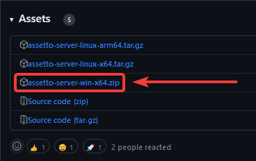
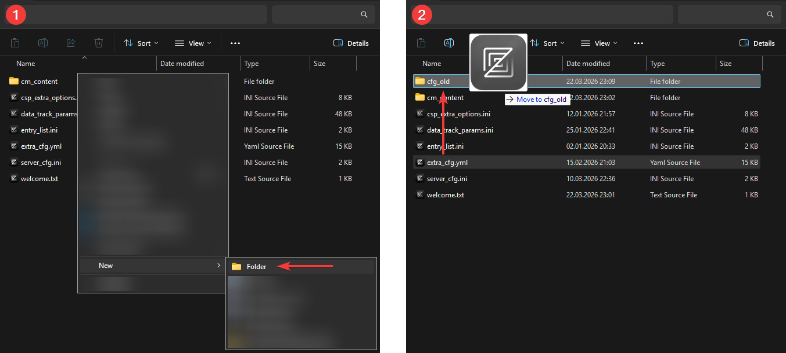
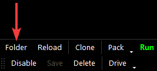

import Tabs from '@theme/Tabs';
import TabItem from '@theme/TabItem';

## Introduction {#intro}

This page will guide you through the process of updating your AssettoServer from 0.0.54 to 0.0.55 on a windows machine. If you do not already have a server configured or want to start fresh anyway, read and follow [the Beginner's Guide](./thebeginnersguide.md) instead.

## Prerequisites {#prerequisites}

To follow along you will need the following things:

- A server already using AssettoServer 0.0.54.
- The **latest** version of AssettoServer 0.0.55.
- Having read the changes in the [Changelog](https://github.com/compujuckel/AssettoServer/releases/tag/v0.0.55).
- Basic understanding of how text editors work.

### Downloading the latest version of AssettoServer 0.0.55 {#latest-version}

1. Go to [the latest GitHub release of AssettoServer](https://github.com/compujuckel/AssettoServer/releases/latest).

2. Click on `assetto-server-win-x64.zip` in the Assets section of the release to download the file.

   

## Backing up & Updating {#backup-updating}

The new version comes with significant changes to the `extra_cfg.yml` and how plugins are configured, meaning that you cannot reuse your existing `extra_cfg.yml` as is.

:::caution

The following steps have slight differences between hosting in a dedicated folder and within Content Manager, simply click on the corresponding tab below.

:::

<Tabs groupId="install-method" >
  <TabItem value="folder" label="Dedicated Folder">

1. Navigate to the `cfg` folder of your current server and create a new folder called `cfg_old`.

2. Move your existing `extra_cfg.yml` into the `cfg_old` folder.
   

3. Now, navigate back into the main folder of your server and extract the AssettoServer 0.0.55 release `assetto-server-win-x64.zip` we downloaded earlier into it, overwriting files if prompted.

4. Run the new `AssettoServer.exe` once to generate a new, updated `extra_cfg.yml`.

5. Return to the `cfg` folder, open the new `extra_cfg.yml` and, using your old `extra_cfg.yml` from the `cfg_old` folder as a reference, enable the plugins you previously had enabled.  
   **Do not copy the old plugin configurations from the bottom of your old `extra_cfg.yml`!**

6. Run the `AssettoServer.exe` again to generate the new plugin configuration files. They will be generated next to the `extra_cfg.yml` inside the `cfg` folder.

7. Using your old `extra_cfg.yml` you can now edit the `extra_cfg.yml` and `plugin_name_cfg.yml` files to restore your old settings.

</TabItem>
<TabItem value="cm" label="Inside Content Manager">

1. Open the preset folder by clicking on the folder button at the bottom of your preset.  
   

2. Create a new folder called `cfg_old`.

3. Move your existing `extra_cfg.yml` into the `cfg_old` folder.
   

4. Now, navigate to the `\server` folder inside your Assetto Corsa installation.  
   By default, this folder is located in `C:\Steam\steamapps\common\assettocorsa\server`.

5. Extract `assetto-server-win-x64.zip` into the `C:\Steam\steamapps\common\assettocorsa\server` folder so that the `AssettoServer.exe` is in the same folder as `acServer.exe`.

6. If you already have a `acServer.exe` with the AssettoServer logo, simply delete it. Otherwise rename `acServer.exe` to something else. (`acServer_default.exe` for example)

7. Rename the new `AssettoServer.exe` to `acServer.exe`

8. In Content Manager, click on the `Run` button of the preset to generate a updated `extra_cfg.yml`

9. Return to the preset folder, open the new `extra_cfg.yml` and, using your old `extra_cfg.yml` from the `cfg_old` folder as a reference, enable the plugins you previously had enabled.  
   **Do not copy the old plugin configurations from the bottom of your old `extra_cfg.yml`!**

10. Run the preset again to generate the new plugin configuration files. They will be generated next to the `extra_cfg.yml` inside the preset folder.

11. Using your old `extra_cfg.yml` you can now edit the `extra_cfg.yml` and `plugin_name_cfg.yml` files to restore your old settings.

</TabItem>
</Tabs>

:::danger
Do not copy or restore old parameters if they are no longer present in the new `extra_cfg.yml`, they have either been moved somewhere else (like a plugin configuration file) or been removed completely.  
Refer to the [changelog](https://github.com/compujuckel/AssettoServer/releases/tag/v0.0.55) and the comment above each parameter.
:::
