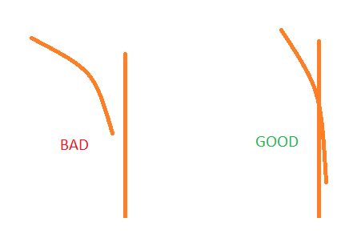

## Prerequisites
- Blender with [io_import_accsv addon](https://github.com/leBluem/io_import_accsv)
- CSP 0.1.77 or later (for recording the splines only)
- New AI spline recorder from pinned message in #ai-spline-discussion
- AssettoServer 0.0.47-pre11 or later
- FastLaneUtils (included in AssettoServer download)

:::note

New to Blender? [This guide](https://docs.google.com/presentation/d/1Qh0qBiuyNIxGNFkCEvPtKm4lhmXrD9HtXm1CPiH-UVA/edit?usp=sharing) by srinoob#8671 will be helpful!

:::

## Recording splines
- Point-to-point splines should be recorded with the new AI spline recorder app.
- When recording junction points / connections between AI splines, try to be as smooth as possible. Sudden direction changes will look bad.
- Make sure that the AI splines intersect.
- Try to keep spline overlapping minimal. Do not record the same lane multiple times. Obstacle detection between AI cars does not work between different splines, so AI cars might be driving through each other when a lane has multiple splines.



## Processing splines
Let's say you already have a main spline called `fast_lane.ai` and want to add a side road to it.

Import your splines into Blender `File > Import > AC fast_lane.ai (.ai)`.  
Remember to check `dont connect first/last verts` when importing point-to-point splines.

After importing it should look like this (new spline in orange):


Find the location where you want to place the start junction.


Go to Edit mode and enable indices under `Overlays > Developer > Indices`


A good junction here would be `148618 -> 28`. The `148618` will later be used as a starting point for your junction.  
Now find the position of the end junction, the part where your side road merges back into the main road.


`766 -> 208214` looks smooth here. We will now use the start and end points to cut the spline using `FastLaneUtils`:

```
.\FastLaneUtils -i fast_lane.ai.candidate -o fast_lane_side.ai --start 28 --end 766 --optimize
```
(if you don't know how to use this: go to the folder with FastLaneUtils.exe, shift+right click and select "Open PowerShell window here". Then type the above command, but change the parameters accordingly)

Optimizing is optional but it will massively decrease the filesize of the spline.  
**Keep in mind that optimized splines can only be used by AssettoServer. It is recommended to not delete your original splines, in case you need them later.**

Place all of your AI splines in the `ai` folder of your map now.

## Creating junctions

In the `ai` folder, create a new file called `config.yml`. For our example it will look like this:

```yaml
# Restrict AI spline to a certain track so it cannot be loaded on other tracks
Track: shuto_revival_project_beta
# Free field, enter whatever you want
Author: Example
# Version of the spline, useful if you are going to publish updates to your spline. Increment it if you made any changes
Version: 1
Splines:
# Filename of the AI spline
- Name: fast_lane.ai
  # List of junctions for this spline
  Junctions:
  # Name of the junction, enter whatever you want
  - Name: Main -> Side road
    # ID of starting point
    Start: 148618
    # End point of junction. Format: <filename>@<id of point>
    End: fast_lane_side.ai@0
    # Probability of an AI car taking the junction. 0.2 = 20%
    Probability: 0.2
    # Indicate when the junction is taken. Possible values None/Left/Right (optional)
    IndicateWhenTaken: Right
    # Indicate when the junction is NOT taken. Possible values None/Left/Right (optional)
    IndicateWhenNotTaken: Left
    # Start indicating x meters before the junction point. (optional, 75m default)
    IndicateDistancePre: 75
    # Stop indicating x meters after the junction point. (optional, 50m default)
    IndicateDistancePost: 50
- Name: fast_lane_side.ai
  # Connect the last point of this spline to another spline. Use this instead of a junction to connect spline ends
  ConnectEnd: fast_lane.ai@208214
  # Indicate at the spline end. Possible values None/Left/Right (optional)
  IndicateEnd: Right
  # Start indicating x meters before the spline end (optional, 150m default)
  IndicateEndDistancePre: 150
  # End indicating x meters after spline end (optional, 10m default)
  IndicateEndDistancePost: 10
```

Note that we used `fast_lane_side.ai@0` instead of `fast_lane_side.ai@28` for the junction end point, because we cut the spline with `FastLaneUtils`.

Now you are ready to try it out!

## Distributing splines

Dealing with a large number of splines can be annoying, especially if you plan to distribute them to other people.  
For this you can create AI packages. Just create a zip file that contains all your splines + your `config.yml` and change the file name to `fast_lane.aip`.  

:::caution

Make sure to change the file ending to `.aip` instead of `.zip`!  
When the server finds an `.aip` file in your `ai` folder it will ignore all other splines in that folder and only load the `.aip` file.

:::