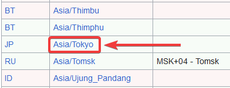
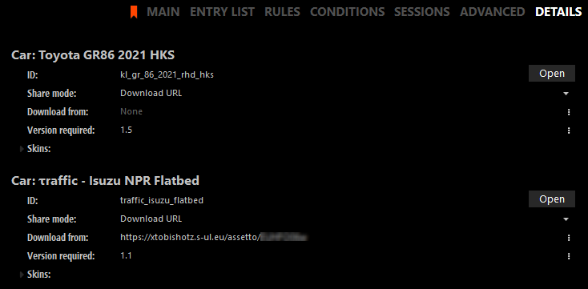
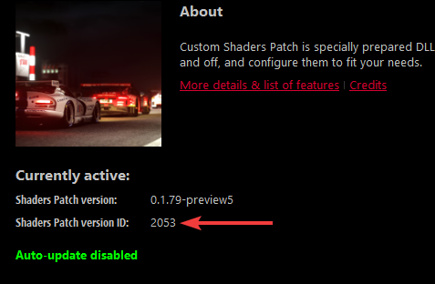
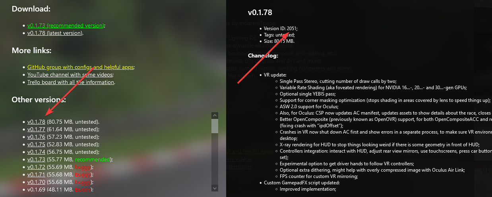

import Tabs from '@theme/Tabs';
import TabItem from '@theme/TabItem';

## How do I get dense traffic? {#dense-traffic}

- Use more traffic slots. This is the most important setting. It is pretty much impossible to achieve high traffic density with just 10 traffic cars, for example.
- Decrease `MinAiSafetyDistanceMeters` / `MaxAiSafetyDistanceMeters` to make gaps between AI cars smaller.  
  **Don't set it lower than ~12m or you might experience AI cars braking immediately after spawning!**
- Decrease `MinSpawnDistancePoints` / `MaxSpawnDistancePoints` to spawn cars closer to the player and fill up gaps in traffic.

## Why am I spawning in a different location than expected? {#spawn-locations}

Where you spawns depends on where the pit for each index is located for track and layout that you chose.  
For example, the Overload Layout of Shutoko Revival Project combines all 170 pits into a single layout.  
Because of that, it is possible to spawn in different locations depending on the index that each car has in the `entry_list.ini`.  
Here is a short list of which indices correspond to which spawn location for Shutoko Revival Project - Overload Layout:

| Car Indices                | Spawn Location            |
| -------------------------- | ------------------------- |
| `[CAR_0]`   to `[CAR_39]`  | Tatsumi PA                |
| `[CAR_40]`  to `[CAR_67]`  | Shibaura PA               |
| `[CAR_68]`  to `[CAR_86]`  | Yoyogi PA                 |
| `[CAR_87]`  to `[CAR_139]` | Heiwajima PA - Northbound |
| `[CAR_140]` to `[CAR_155]` | Heiwajima PA - Southbound |
| `[CAR_156]` to `[CAR_169]` | Daishi PA                 |

:::caution
It is not possible to skip or have duplicate indices in the `entry_list.ini`.  
Meaning that you cannot start your entry list with `[CAR_87]` to make everyone spawn at Heiwajima.  
:::

## How do I remove checksums? {#remove-checksums}

:::caution ONLY REMOVE CHECKSUMS IF YOU'RE OKAY WITH USERS CHEATING
Checksums are required to prevent people from cheating by modifying their car and track data. Remove them at your own risk.
:::

<Tabs>
<TabItem value="cars" label="Car Checksums" default>

  - Navigate to the `\content\cars` folder on your server.
  - Remove the `data.acd` in the folder of every car that you want to use without checksums.
  - Enable MissingCarChecksums in `extra_cfg.yml` and restart the server.
  - If you've done everything correctly you should no longer see a `Added checksum for car_name` log message for the car you removed. If you've removed the checksum of all cars it should also log `Initialized 0 car checksums`.

</TabItem>
<TabItem value="tracks" label="Track Checksums">

  - Navigate to the `\content\tracks\<track>\<layout>\data` and `\system` folders on your server.
  - Remove both of the `surfaces.ini` files and restart the server.
  - If you've done everything correctly you should see the log message saying `Initialized 0 track checksums`

</TabItem>
</Tabs>

## How do I add missing track params? {#adding-trackparams}

You can either add the parameters locally or ignore this error by setting `MissingTrackParams` to `true` in `extra_cfg.yml`.  
Keep in mind that setting `MissingTrackParams` to `true` can result in time not being synchronized between players and the server.  

<Tabs>
<TabItem value="new" label="Create New" default>

Navigate to the `cfg` folder of the server and open the `data_track_params.ini`.  
Go to the bottom of the file and add a section for your track using the folder name of your track as the header like this:
```ini title="data_track_params.ini"
[shuto_revival_project_beta_ptb]
NAME=SRP PTB
LATITUDE=
LONGITUDE=
TIMEZONE=
```

Open [Google Maps](https://www.google.com/maps/) and find the location of the track.  
Right click onto the map and click the Longitute and Latitute values that will be shown as the first option to copy them.  
  
Paste them after the `LATITUDE=` and `LONGITUDE=` keys.

Open a [TZ timezone list](https://en.wikipedia.org/wiki/List_of_tz_database_time_zones) and look for the time zone that the track is in, then copy the `TZ Identifier`.
  
Paste it after the `TIMEZONE=` key.

You should now have something along the lines of this:
```ini title="data_track_params.ini"
[shuto_revival_project_beta_ptb]
NAME=SRP PTB
LATITUDE=35.67040
LONGITUDE=139.74085
TIMEZONE=Asia/Tokyo
```

</TabItem>
<TabItem value="reuse" label="Reuse Existing" default>

Navigate to the `cfg` folder of the server and open the `data_track_params.ini`.  
Find and copy the entry for the track you want to reuse.  
Change the header of the copied section to the folder name your current track.  
```ini title="data_track_params.ini"
; Original
[shuto_revival_project_beta]
NAME=SRP
LATITUDE=35.670479
LONGITUDE=139.740921
TIMEZONE=Asia/Tokyo
; Copied
[shuto_revival_project_beta_ptb]
NAME=SRP PTB
LATITUDE=35.670479
LONGITUDE=139.740921
TIMEZONE=Asia/Tokyo
```

</TabItem>
</Tabs>

Save and close the file, open `extra_cfg.yml` and set `ForceServerParams` to `true`.  
Please also adjust `MinimumCSPVersion` if needed.
```yaml title="extra_cfg.yml"
# Override minimum CSP version required to join this server. Leave this empty to not require CSP.
MinimumCSPVersion: 2144

# Force clients to use track params (coordinates, time zone) specified on the server. CSP 0.1.79+ required
ForceServerTrackParams: true
```

## How do I use CSP extra server options? {#csp-extra-options}

Read [this CSP wiki page](https://github.com/ac-custom-shaders-patch/acc-extension-config/wiki/Misc-%E2%80%93-Server-extra-options) carefully. Everything you want to add goes into `cfg/csp_extra_options.ini`.  
If the file doesn't exist yet, create it yourself. For example:

    
Place the file in the `cfg` folder of your server.  

:::note

If you're hosting the server via Content Manager, click the `Folder` button at the bottom of the preset and place it there instead.

:::

### How do I allow driving the wrong way? {#wrong-way}

```ini title="csp_extra_options.ini"
[EXTRA_RULES]
ALLOW_WRONG_WAY = 1 
```  
If you get teleported back to pits, you may need to remove the `fast_lane.ai` for the track in your local game files.  
By default: `C:\Program Files (x86)\Steam\steamapps\common\assettocorsa\content\tracks\<trackname>`.  

### How do I enable Teleportation? {#teleportation}

For teleporting, two things have to be done:

- Allowing cars in the entry list to teleport
- Adding teleport destinations to the `csp_extra_options.ini`

Depending on if you have the full version of Content Manager or not, there are two different ways to accomplish this:

<Tabs>
<TabItem value="content-manager" label="With Content Manager (Full Version)" default>

  Check `Allow teleporting` for each car on your entry list:  
  

  Click on the `Folder` button at the bottom of your server, open `csp_extra_options.ini` and add your teleport destinations to it.  
  

</TabItem>
<TabItem value="manual" label="Without Content Manager">

  - In your `entry_list.ini` add a option to the end of each skin, for example `SKIN=<skinname>/ADAn`

  | Code    | Option                                  |
  | ------- | --------------------------------------- |
  | `/ACA3` | Allow Teleporting                       |
  | `/ABAH` | Allow Color Changing                    |
  | `/ADAn` | Allow both Color Changing & Teleporting |

  This is **NOT** a full list of all codes and options available, just some of the most frequently used ones.  
  [Here is how it’s generated by Content Manager.](https://github.com/gro-ove/actools/blob/master/AcManager.Tools/Objects/ServerDriverCspOptions.cs#L123)

  - In the `cfg` folder of your server, open `csp_extra_options.ini` and add your teleport destinations to it.

</TabItem>
</Tabs>  

If done correctly you should now have a `Teleport to...` option in the chat apps extras:  


#### Where can I find teleport locations for SRP? {#srp-teleports}

Either use the official SRP teleports below or make some yourself.  

<details>
<summary>Official Shutoko Revival Project Teleport locations</summary>
<p>

```ini title="csp_extra_options.ini"
[TELEPORT_DESTINATIONS]
POINT_1 = Position 1
POINT_1_GROUP = Shibaura PA
POINT_1_POS = 1098.82, 25.28, -4642.14
POINT_1_HEADING = 246

POINT_2 = Position 2
POINT_2_GROUP = Shibaura PA
POINT_2_POS = 1098.77, 25.28, -4649.76
POINT_2_HEADING = 245

POINT_3 = Position 3
POINT_3_GROUP = Shibaura PA
POINT_3_POS = 1098.9, 25.28, -4657.39
POINT_3_HEADING = 246

POINT_4 = Position 4
POINT_4_GROUP = Shibaura PA
POINT_4_POS = 1099.37, 25.31, -4664.88
POINT_4_HEADING = 246

POINT_5 = Position 5
POINT_5_GROUP = Shibaura PA
POINT_5_POS = 1099.15, 25.31, -4672.42
POINT_5_HEADING = 245

POINT_6 = Position 1
POINT_6_GROUP = Tatsumi PA
POINT_6_POS = 5862.09, 23.31, -4648.95
POINT_6_HEADING = 267

POINT_7 = Position 2
POINT_7_GROUP = Tatsumi PA
POINT_7_POS = 5850.9, 22.89, -4644.56
POINT_7_HEADING = 268

POINT_8 = Position 3
POINT_8_GROUP = Tatsumi PA
POINT_8_POS = 5839.74, 22.47, -4640.04
POINT_8_HEADING = 268

POINT_9 = Position 1
POINT_9_GROUP = Daishi PA
POINT_9_POS = -308.59, 15.49, 6143.8
POINT_9_HEADING = 68

POINT_10 = Position 2
POINT_10_GROUP = Daishi PA
POINT_10_POS = -308.48, 15.47, 6150.66
POINT_10_HEADING = 68

POINT_11 = Position 3
POINT_11_GROUP = Daishi PA
POINT_11_POS = -308.13, 15.44, 6157.93
POINT_11_HEADING = 66

POINT_12 = Position 1
POINT_12_GROUP = Heiwajima PA North
POINT_12_POS = -230.06, 12.3, 1360.02
POINT_12_HEADING = 104

POINT_13 = Position 2
POINT_13_GROUP = Heiwajima PA North
POINT_13_POS = -234.92, 12.3, 1354.07
POINT_13_HEADING = 106

POINT_14 = Position 3
POINT_14_GROUP = Heiwajima PA North
POINT_14_POS = -239.82, 12.3, 1348.12
POINT_14_HEADING = 105

POINT_15 = Position 1
POINT_15_GROUP = Oi PA
POINT_15_POS = 964.93, 6.7, -126.06
POINT_15_HEADING = 156

POINT_16 = Position 2
POINT_16_GROUP = Oi PA
POINT_16_POS = 964.9, 6.75, -138.0
POINT_16_HEADING = 156

POINT_17 = Position 3
POINT_17_GROUP = Oi PA
POINT_17_POS = 964.82, 6.8, -151.17
POINT_17_HEADING = 156

POINT_18 = Position 1
POINT_18_GROUP = Mirai - Kinko JCT
POINT_18_POS = -10854.32, 11.96, 13422.77
POINT_18_HEADING = 287

POINT_19 = Position 2
POINT_19_GROUP = Mirai - Kinko JCT
POINT_19_POS = -10846.16, 11.97, 13415.76
POINT_19_HEADING = 283

POINT_20 = Position 1
POINT_20_GROUP = Bayshore North - Kawasaki Port
POINT_20_POS = -83.84, 7.1, 10983.11
POINT_20_HEADING = 273

POINT_21 = Position 2
POINT_21_GROUP = Bayshore North - Kawasaki Port
POINT_21_POS = -102.97, 7.72, 10993.15
POINT_21_HEADING = 274

POINT_24 = Position 1
POINT_24_GROUP = C1 Outer - Edobashi JCT
POINT_24_POS = 2512.15, 12.23, -9223.27
POINT_24_HEADING = 231

POINT_25 = Position 2
POINT_25_GROUP = C1 Outer - Edobashi JCT
POINT_25_POS = 2503.33, 12.02, -9225.59
POINT_25_HEADING = 232

POINT_26 = Position 1
POINT_26_GROUP = Shinjuku Station
POINT_26_POS = -4251.66, 32.94, -10032.48
POINT_26_HEADING = 208

POINT_27 = Position 2
POINT_27_GROUP = Shinjuku Station
POINT_27_POS = -4244.07, 32.94, -10016.75
POINT_27_HEADING = 159

POINT_28 = Position 3
POINT_28_GROUP = Shinjuku Station
POINT_28_POS = -4242.9, 32.95, -9995.6
POINT_28_HEADING = 160

POINT_29 = Position 1
POINT_29_GROUP = Yokohama - Daikoku
POINT_29_POS = -6147.93, 29.65, 13722.33
POINT_29_HEADING = 346

POINT_30 = Position 2
POINT_30_GROUP = Yokohama - Daikoku
POINT_30_POS = -6151.91, 29.71, 13702.23
POINT_30_HEADING = 347

POINT_34 = Position 1
POINT_34_GROUP = Heiwajima PA - South
POINT_34_POS = -135.82, 6.57, 1475.1
POINT_34_HEADING = 128

POINT_35 = Position 2
POINT_35_GROUP = Heiwajima PA - South
POINT_35_POS = -141.18, 6.55, 1463.26
POINT_35_HEADING = 132

POINT_36 = Position 3
POINT_36_GROUP = Heiwajima PA - South
POINT_36_POS = -146.6, 6.48, 1451.75
POINT_36_HEADING = 130

POINT_37_GROUP = C1 Inner - Ginza
POINT_37_POS = 2189.27, -1.7, -7551.21
POINT_37_HEADING = 111

POINT_38 = Position 2
POINT_38_GROUP = C1 Inner - Ginza
POINT_38_POS = 2179.76, -1.66, -7541.2
POINT_38_HEADING = 291

POINT_39 = Position 1
POINT_39_GROUP = Bayshore North - Tamagawa River Tunnel
POINT_39_POS = 4104.18, -7.82, 8489.0
POINT_39_HEADING = 304

POINT_40 = Position 2
POINT_40_GROUP = Bayshore North - Tamagawa River Tunnel
POINT_40_POS = 4121.05, -8.34, 8463.49
POINT_40_HEADING = 303

POINT_41 = Position 1
POINT_41_GROUP = Bayshore South - Haneda Airport
POINT_41_POS = 3278.37, 0.83, 4292.55
POINT_41_HEADING = 197

POINT_42 = Position 2
POINT_42_GROUP = Bayshore South - Haneda Airport
POINT_42_POS = 3265.07, 0.72, 4278.06
POINT_42_HEADING = 199

POINT_42 = Position 2
POINT_42_GROUP = Bayshore South - Haneda Airport
POINT_42_POS = 3265.07, 0.72, 4278.06
POINT_42_HEADING = 199

POINT_43 = Position 1
POINT_43_GROUP = Kariba - Sakuragicho
POINT_43_POS = -7478.14, 13.01, 16477.58
POINT_43_HEADING = 22

POINT_44 = Position 1
POINT_44_GROUP = C1 Inner - Kitanomaru
POINT_44_POS = 767.52, 16.46, -9914.88
POINT_44_HEADING = 87

POINT_45 = Position 2
POINT_45_GROUP = C1 Inner - Kitanomaru
POINT_45_POS = 782.83, 16.48, -9921.26
POINT_45_HEADING = 89

POINT_46 = Position 1
POINT_46_GROUP = Belt Inner - Fukuzumi
POINT_46_POS = 4522.27, 13.97, -8210.62
POINT_46_HEADING = 350

POINT_47 = Position 2
POINT_47_GROUP = Belt Inner - Fukuzumi
POINT_47_POS = 4524.72, 14.32, -8199.7
POINT_47_HEADING = 349

POINT_48 = Position 1
POINT_48_GROUP = Yokohane - Kawasaki
POINT_48_POS = -2533.62, 11.02, 8864.47
POINT_48_HEADING = 86

POINT_49 = Position 1
POINT_49_GROUP = C1 Outer - Bayshore Access
POINT_49_POS = 1371.26, 9.75, -6547.1
POINT_49_HEADING = 117

POINT_50 = Position 2
POINT_50_GROUP = C1 Outer - Bayshore Access
POINT_50_POS = 1363.85, 9.72, -6537.63
POINT_50_HEADING = 118

POINT_51 = Position 1
POINT_51_GROUP = C1 Outer - Shibakoen
POINT_51_POS = 317.95, 12.98, -5719.14
POINT_51_HEADING = 63

POINT_52 = Position 2
POINT_52_GROUP = C1 Outer - Shibakoen
POINT_52_POS = 305.85, 12.77, -5720.29
POINT_52_HEADING = 61

POINT_53 = Position 1
POINT_53_GROUP = Shibuya - Takigicho
POINT_53_POS = -2171.65, 36.81, -6448.03
POINT_53_HEADING = 72

POINT_54 = Position 2
POINT_54_GROUP = Shibuya - Takigicho
POINT_54_POS = -2159.52, 36.76, -6449.3
POINT_54_HEADING = 73

POINT_55 = Position 1
POINT_55_GROUP = Shibuya Access
POINT_55_POS = -4581.37, 34.66, -6013.55
POINT_55_HEADING = 80

POINT_56 = Position 2
POINT_56_GROUP = Shibuya Access
POINT_56_POS = -4754.61, 34.66, -5829.99
POINT_56_HEADING = 12

POINT_57 = Position 1
POINT_57_GROUP = Yoyogi PA
POINT_57_POS = -4305.15, 36.75, -8883.11
POINT_57_HEADING = 176

POINT_58 = Position 2
POINT_58_GROUP = Yoyogi PA
POINT_58_POS = -4313.3, 36.74, -8883.06
POINT_58_HEADING = 174

POINT_59 = Position 3
POINT_59_GROUP = Yoyogi PA
POINT_59_POS = -4324.46, 36.73, -8882.26
POINT_59_HEADING = 174

POINT_60 = Position 1
POINT_60_GROUP = C1 Inner - Shibakoen
POINT_60_POS = 100.29, 12.23, -5830.58
POINT_60_HEADING = 191

POINT_61 = Position 2
POINT_61_GROUP = C1 Inner - Shibakoen
POINT_61_POS = 92.52, 12.25, -5841.12
POINT_61_HEADING = 193

POINT_62 = Position 1
POINT_62_GROUP = Yokohane South - Shinagawa
POINT_62_POS = 550.84, 12.4, -3796.74
POINT_62_HEADING = 133

POINT_63 = Position 1
POINT_63_GROUP = Bayshore North - Honmoku JCT
POINT_63_POS = -7075.91, 32.86, 16318.26
POINT_63_HEADING = 351

POINT_64 = Position 2
POINT_64_GROUP = Bayshore North - Honmoku JCT
POINT_64_POS = -7079.04, 33.16, 16306.44
POINT_64_HEADING = 351
```

</p>
</details>

#### How do I make my own teleport locations? {#making-teleports}

You can use the Objects Inspector or the [comfy map app](https://www.racedepartment.com/downloads/comfy-map.52623/) to determine the coordinates and heading.  
The formating is as follows:

```ini
POINT_0 = Name               ; destination name
POINT_0_GROUP = Group Name   ; optional group
POINT_0_POS = X, Y, Z        ; coordinates
POINT_0_HEADING = 0          ; heading angle in degrees
```

**Having the comfy map app is not necessary to create points, enable or use teleportation!**

### How do I enable Color Changing? {#color-changing}

```ini title="csp_extra_options.ini"
[CUSTOM_COLOR]
ALLOW_EVERYWHERE = 1
```

If AI cars are allowed to change their colors, they will spawn in random colors if possible.  
**Keep in mind that you still need to allow cars to change colors via the `entry_list.ini` even if you're using `ALLOW_EVERYWHERE`.**

### How do I increase the speed in the pits? {#pit-speed-limiter}

```ini title="csp_extra_options.ini"
[PITS_SPEED_LIMITER]
KEEP_COLLISIONS = 0    ; will either activate or deactivate collisions between cars in the pits.
SPEED_KMH = 80         ; the maximum speed allowed, the default is 80.
```

[There are more options available here.](https://github.com/ac-custom-shaders-patch/acc-extension-config/wiki/Misc-%E2%80%93-Server-extra-options#pit-speed-limiter-settings)

### How do I use Server Scripts? {#csp-server-scripts}

:::note

Keep in mind that Server Scripts are different from AssettoServer Plugins, and we don’t provide support for them on our Discord.

:::

You're going to need to host your script in plaintext somewhere publicly accessible, for example:
  - Github / Pastebin
  - Your own media server (like IIS or others)
  - **DO NOT HOST ON DISCORD**

```ini title="csp_extra_options.ini"
[SCRIPT_...]
SCRIPT = "https://pastebin.com/raw/00000000000"    ; change this to the url of your script
```

[There are more options available here.](https://github.com/CheesyManiac/cheesy-lua/wiki/Extra-CSP-Server-Config-Values#server-scripts)

## How do I allow players to download missing content? {#download-missing-content}

It's possible to allow players to download missing content like tracks and cars in the Content Manager server browser.


:::caution

Please use the download links the authors of the content you're using provide unless you're explicitly allowed to reupload them for yourself.

:::

<Tabs>
<TabItem value="content-manager" label="With Content Manager (Full Version)" default>

  - Navigate to the `Details` Tab in your Server preset.
  - In the `Share Mode` tab select "Download URL" and paste the direct download link into the `Download from` field.
  - Leave `Version Required` as it is since CM will autofill these for you, then save the preset.
  - A `content.json` file will be created in the `cm_content` folder under the directory of the server. Currently, this file does not get included when using the Pack feature.

  

</TabItem>
<TabItem value="manual" label="Without Content Manager">

  - Navigate to the `cfg` folder of your server.
  - Create a `cm_content` folder and in that folder a file named `content.json`.
  - In `content.json` you can now configure download links like so:

  ```json
  {
    "cars": {
      "car_name_here": {
        "url": "download url here",
        "version": "version here"
      },
      "car_name_two": {
        "url": "download url here",
        "version": "version here"
      }
    },
    "track": {
      "url": "download url here",
      "version": "version here"
    }
  }
  ```

  - The `version` has to match the version shown in the `Author` field in the content tab of the car/track.
  

</TabItem>
</Tabs>

## How can I enable a Custom Steam API Replacement? {#custom-steam-api}
**AssettoServer does not support piracy and as such there is no way around buying Assetto Corsa and the DLC's required by the content you want to use.**  
If you used a pirated version of Assetto Corsa in the past and have since purchased everything, make sure to:  
- Verify your game files via Steam
- Change the Assetto Corsa game folder in the Content Manager general settings to your Steam installation.  
By default: `C:\Program Files (x86)\Steam\steamapps\common\assettocorsa\`

## How can I format my server description? {#server-description}

**Linebreaks**  
The `|-` modifier is probably the most important part to properly format your description.  
Read this site for more information: https://yaml-multiline.info/

**BBcode**  
The description in Content Manager uses BBcode tags, read: https://www.bbcode.org/reference.php  
To add images use `[img=<link>]img1[/img]`  
Keep in mind that some functions of BBcode are not supported by Content Manager.

**Example Description**
```yaml title="extra_cfg.yml"
ServerDescription: |-
  [img=https://assettoserver.org/img/as-logo-cm.png]AssettoServer Logo[/img]

  [size=16]                   [b]UNOFFICIAL AI TRAFFIC TEST SERVER[/b]

                Car and track downloads, installation help:
                          [url=https://discord.com/invite/shutokorevivalproject]Shutoko Revival Project Discord[/url]
                              Server news and feedback:
                      [url=https://discord.gg/uXEXRcSkyz]AssettoServer Development Discord[/url]
                                    [color=#FF424D]Support the server:[/color]
                                              [url=https://www.patreon.com/assettoserver]Patreon[/url]
  [size=22][b]Rules[/b][/size]
  [color=#E82A1F][size=18][b]- Keep chat app open at all times.[/b][/size][/color]
  [size=18][color=#E82A1F][b]- [u]PLEASE TURN YOUR LIGHTS ON[/u][size=16]
    when its night so other drivers can see you.[/size][/b][/color][/size]
  - Don't run into other cars on purpose.
  - Do not park or block the road.
    Pull off as much to the side as possible or return to pits.
  - Be respectful of other drivers, keep a comfortable distance
    when driving with others.
  - Don't drive into oncoming traffic. This is Japan.
    Drive on the left side of the road.
  - Don't cause drama in the chat. This includes spamming and
    harassment.
  - If you dont have Sol working, or are otherwise in doubt,
    keep your lights on.
```

## Where can I find the CSP version IDs? {#csp-version-ids}

The easiest way to get the ID for the CSP Version you're using is opening Content Manager and navigating to `Settings > Custom Shaders Patch > About & Updates` and then reading the Currently active Shaders Patch version ID.



If you need the ID of a version you currently don't have installed [the official CSP Website](https://acstuff.ru/patch/) also has the IDs in the `Other Versions` sections.


