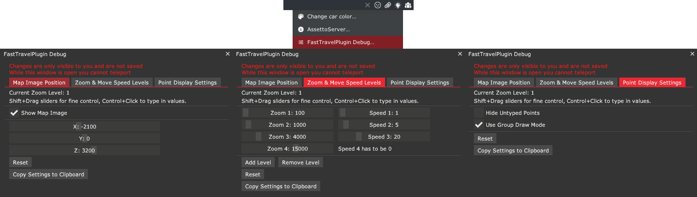

import Tabs from '@theme/Tabs';
import TabItem from '@theme/TabItem';

# FastTravelPlugin

:::note

Forced minimum CSP version of 0.2.8 (3424), `EnableClientMessages: true` and `EnableAi: true` in `extra_cfg.yml` are required for this plugin!  

:::

## Features
* Allows players to teleport anywhere on the track.
* Supports CSP teleportation points (configured in `csp_extra_options.ini`)
* Disables collisions for a while after teleporting to reduce the griefing potential.

## Configuration
Enable the plugin in `extra_cfg.yml`
```yaml title="extra_cfg.yml"
EnablePlugins:
- FastTravelPlugin
```

Example configurations  
<Tabs groupId="fasttravelplugin">
<TabItem value="default" label="Default Configuration" default>

```yaml title="plugin_fast_travel_cfg.yml"
# Available zoom levels. Last one should show the full track.
# If map image is shown, prioritize matching the track to the map image.
# Don't change the values if using Shutoko Revival Project
MapZoomValues:
- 100
- 1000
- 4000
- 15000
# Mouse move speeds of the respective zoom levels.
# Last value needs to be zero.
# Don't change the values if using Shutoko Revival Project
MapMoveSpeeds:
- 1
- 5
- 20
- 0
# Last zoom level has a fixed position, the track should be aligned to the center of the screen.
# If map image is shown, prioritize aligning the track with the map image.
# Don't change the values if using Shutoko Revival Project
MapFixedTargetPosition:
- -2100
- 0
- 3200
# Requires CSP version 0.2.8 (3424) which fixed disabling collisions online. 
# Setting this to false will lower the version requirement to 0.2.0 (2651) and clients will not have disabled collisions when teleporting.
DisableCollisions: true
# Show the map.png of the track layout when in the last zoom level.
# Don't change if using Shutoko Revival Project
ShowMapImage: true
# If true, points without a _TYPE assigned are ignored and not displayed. If false, they will default to SP.
HideUntypedPoints: false
# How teleport icons should cluster when zoomed out.
# True (Group mode): Displays only the first point of each type within a group.
# False (Distance mode): Displays one point of each type based on proximity, ignoring group names.
UseGroupDrawMode: true
# The required distance between icons of the same type to prevent them from clustering.
DistanceModeRange: 100
```

</TabItem>
<TabItem value="imola" label="Imola Example">

```yaml title="plugin_fast_travel_cfg.yml"
# Available zoom levels. Last one should show the full track.
# If map image is shown, prioritize matching the track to the map image.
# Don't change the values if using Shutoko Revival Project
MapZoomValues:
- 100
- 200
- 400
- 600
# Mouse move speeds of the respective zoom levels.
# Last value needs to be zero.
# Don't change the values if using Shutoko Revival Project
MapMoveSpeeds:
- 1
- 2
- 3
- 0
# Last zoom level has a fixed position, the track should be aligned to the center of the screen.
# If map image is shown, prioritize aligning the track with the map image.
# Don't change the values if using Shutoko Revival Project
MapFixedTargetPosition:
- 0
- 0
- 0
# Requires CSP version 0.2.8 (3424) which fixed disabling collisions online. 
# Setting this to false will lower the version requirement to 0.2.0 (2651) and clients will not have disabled collisions when teleporting.
DisableCollisions: true
# Show the map.png of the track layout when in the last zoom level.
# Don't change if using Shutoko Revival Project
ShowMapImage: false
# If true, points without a _TYPE assigned are ignored and not displayed. If false, they will default to SP.
HideUntypedPoints: false
# How teleport icons should cluster when zoomed out.
# True (Group mode): Displays only the first point of each type within a group.
# False (Distance mode): Displays one point of each type based on proximity, ignoring group names.
UseGroupDrawMode: false
# The required distance between icons of the same type to prevent them from clustering.
DistanceModeRange: 100
```

</TabItem>
</Tabs>

## Teleport Destination Configuration  
You can also configure your `csp_extra_option.ini` teleport destinations to be selectable.  
**If you do not have such a file and want to add points please read [this FAQ section](../faq.md#csp-extra-options).**

By default, there are 3 "types" of points:
  - `SP`, the default, only visible on closer zoom levels  
     
  - `PA`, can be assigned to points (or groups, more on that in a bit), is visible even when fully zoomed out.  
       
  - `ST`, same as `PA`, just has a different Icon  
      

  :::note 

  More types and icons can be added by placing additional `mapicon_<TYPE>.png` images into the `\plugins\FastTravelPlugin\wwwroot\` folder.  
  For example adding `mapicon_gs.png` would allow you to use `POINT_<NUM>_TYPE = GS` after restarting the server.   

  :::

All points are treated as `SP` by default, but you can add `POINT_<NUM>_TYPE = <TYPE>` to your teleports to change their type.  
    
For example:
```ini title="csp_extra_options.ini"
  [TELEPORT_DESTINATIONS]
  POINT_1 = Position 1
  POINT_1_GROUP = Shibaura PA
  // highlight-next-line
  POINT_1_TYPE = PA

  POINT_2 = Position 1
  POINT_2_GROUP = Shinjuku Station
  // highlight-next-line
  POINT_2_TYPE = ST
```

<details>
<summary>**Teleport configuration based on the official Shutoko Revival Project teleport locations**</summary>

```ini title="csp_extra_options.ini"
[TELEPORT_DESTINATIONS]
POINT_0 = Position 1
POINT_0_POS = 1098.8,25.3,-4642.1
POINT_0_HEADING = 246
POINT_0_GROUP = Shibaura PA
POINT_0_TYPE = PA

POINT_1 = Position 2
POINT_1_POS = 1098.8,25.3,-4649.8
POINT_1_HEADING = 245
POINT_1_GROUP = Shibaura PA
POINT_1_TYPE = PA

POINT_2 = Position 3
POINT_2_POS = 1098.9,25.3,-4657.4
POINT_2_HEADING = 246
POINT_2_GROUP = Shibaura PA
POINT_2_TYPE = PA

POINT_3 = Position 4
POINT_3_POS = 1099.4,25.3,-4664.9
POINT_3_HEADING = 246
POINT_3_GROUP = Shibaura PA
POINT_3_TYPE = PA

POINT_4 = Position 5
POINT_4_POS = 1099.2,25.3,-4672.4
POINT_4_HEADING = 245
POINT_4_GROUP = Shibaura PA
POINT_4_TYPE = PA

POINT_5 = Position 1
POINT_5_POS = 5862.1,23.3,-4649
POINT_5_HEADING = 267
POINT_5_GROUP = Tatsumi PA
POINT_5_TYPE = PA

POINT_6 = Position 2
POINT_6_POS = 5850.9,22.9,-4644.6
POINT_6_HEADING = 268
POINT_6_GROUP = Tatsumi PA
POINT_6_TYPE = PA

POINT_7 = Position 3
POINT_7_POS = 5839.7,22.5,-4640
POINT_7_HEADING = 268
POINT_7_GROUP = Tatsumi PA
POINT_7_TYPE = PA

POINT_8 = Position 1
POINT_8_POS = -308.6,15.5,6143.8
POINT_8_HEADING = 68
POINT_8_GROUP = Daishi PA
POINT_8_TYPE = PA

POINT_9 = Position 2
POINT_9_POS = -308.5,15.5,6150.7
POINT_9_HEADING = 68
POINT_9_GROUP = Daishi PA
POINT_9_TYPE = PA

POINT_10 = Position 3
POINT_10_POS = -308.1,15.4,6157.9
POINT_10_HEADING = 66
POINT_10_GROUP = Daishi PA
POINT_10_TYPE = PA

POINT_11 = Position 1
POINT_11_POS = -230.1,12.3,1360
POINT_11_HEADING = 104
POINT_11_GROUP = Heiwajima PA North
POINT_11_TYPE = PA

POINT_12 = Position 2
POINT_12_POS = -234.9,12.3,1354.1
POINT_12_HEADING = 106
POINT_12_GROUP = Heiwajima PA North
POINT_12_TYPE = PA

POINT_13 = Position 3
POINT_13_POS = -239.8,12.3,1348.1
POINT_13_HEADING = 105
POINT_13_GROUP = Heiwajima PA North
POINT_13_TYPE = PA

POINT_14 = Position 1
POINT_14_POS = 964.9,6.7,-126.1
POINT_14_HEADING = 156
POINT_14_GROUP = Oi PA
POINT_14_TYPE = PA

POINT_15 = Position 2
POINT_15_POS = 964.9,6.8,-138
POINT_15_HEADING = 156
POINT_15_GROUP = Oi PA
POINT_15_TYPE = PA

POINT_16 = Position 3
POINT_16_POS = 964.8,6.8,-151.2
POINT_16_HEADING = 156
POINT_16_GROUP = Oi PA
POINT_16_TYPE = PA

POINT_17 = Position 1
POINT_17_POS = -10854.3,12,13422.8
POINT_17_HEADING = 287
POINT_17_GROUP = Mirai - Kinko JCT
POOINT_17_TYPE = SP

POINT_18 = Position 2
POINT_18_POS = -10846.2,12,13415.8
POINT_18_HEADING = 283
POINT_18_GROUP = Mirai - Kinko JCT
POINT_18_TYPE = SP

POINT_19 = Position 1
POINT_19_POS = -83.8,7.1,10983.1
POINT_19_HEADING = 273
POINT_19_GROUP = Bayshore North - Kawasaki Port
POINT_19_TYPE = SP

POINT_20 = Position 2
POINT_20_POS = -103,7.7,10993.2
POINT_20_HEADING = 274
POINT_20_GROUP = Bayshore North - Kawasaki Port
POINT_20_TYPE = SP

POINT_21 = Position 1
POINT_21_POS = 2512.1,12.2,-9223.3
POINT_21_HEADING = 231
POINT_21_GROUP = C1 Outer - Edobashi JCT
POINT_21_TYPE = SP

POINT_22 = Position 2
POINT_22_POS = 2503.3,12,-9225.6
POINT_22_HEADING = 232
POINT_22_GROUP = C1 Outer - Edobashi JCT
POINT_22_TYPE = SP

POINT_23 = Position 1
POINT_23_POS = -4251.7,32.9,-10032.5
POINT_23_HEADING = 208
POINT_23_GROUP = Shinjuku Station
POINT_23_TYPE = ST

POINT_24 = Position 2
POINT_24_POS = -4244.1,32.9,-10016.8
POINT_24_HEADING = 159
POINT_24_GROUP = Shinjuku Station
POINT_24_TYPE = ST

POINT_25 = Position 3
POINT_25_POS = -4242.9,33,-9995.6
POINT_25_HEADING = 160
POINT_25_GROUP = Shinjuku Station
POINT_25_TYPE = ST

POINT_26 = Position 1
POINT_26_POS = -6147.9,29.6,13722.3
POINT_26_HEADING = 346
POINT_26_GROUP = Yokohama - Daikoku
POINT_26_TYPE = SP

POINT_27 = Position 2
POINT_27_POS = -6151.9,29.7,13702.2
POINT_27_HEADING = 347
POINT_27_GROUP = Yokohama - Daikoku
POINT_27_TYPE = SP

POINT_28 = Position 1
POINT_28_POS = -135.8,6.6,1475.1
POINT_28_HEADING = 128
POINT_28_GROUP = Heiwajima PA - South
POINTS_28_TYPE = PA

POINT_29 = Position 2
POINT_29_POS = -141.2,6.6,1463.3
POINT_29_HEADING = 132
POINT_29_GROUP = Heiwajima PA - South
POINT_29_TYPE = PA

POINT_30 = Position 3
POINT_30_POS = -146.6,6.5,1451.8
POINT_30_HEADING = 130
POINT_30_GROUP = Heiwajima PA - South
POINT_30_TYPE = PA

POINT_31 = Position 2
POINT_31_POS = 2179.8,-1.7,-7541.2
POINT_31_HEADING = 291
POINT_31_GROUP = C1 Inner - Ginza
POINT_31_TYPE = SP

POINT_32 = Position 1
POINT_32_POS = 4104.2,-7.8,8489
POINT_32_HEADING = 304
POINT_32_GROUP = Bayshore North - Tamagawa River Tunnel
POINT_32_TYPE = SP

POINT_33 = Position 2
POINT_33_POS = 4121,-8.3,8463.5
POINT_33_HEADING = 303
POINT_33_GROUP = Bayshore North - Tamagawa River Tunnel
POINT_33_TYPE = SP

POINT_34 = Position 1
POINT_34_POS = 3278.4,0.8,4292.5
POINT_34_HEADING = 197
POINT_34_GROUP = Bayshore South - Haneda Airport
POINT_34_TYPE = SP

POINT_35 = Position 2
POINT_35_POS = 3265.1,0.7,4278.1
POINT_35_HEADING = 199
POINT_35_GROUP = Bayshore South - Haneda Airport
POINT_35_TYPE = SP

POINT_36 = Position 1
POINT_36_POS = -7478.1,13,16477.6
POINT_36_HEADING = 22
POINT_36_GROUP = Kariba - Sakuragicho
POINT_36_TYPE = SP

POINT_37 = Position 1
POINT_37_POS = 767.5,16.5,-9914.9
POINT_37_HEADING = 87
POINT_37_GROUP = C1 Inner - Kitanomaru
POINT_37_TYPE = SP

POINT_38 = Position 2
POINT_38_POS = 782.8,16.5,-9921.3
POINT_38_HEADING = 89
POINT_38_GROUP = C1 Inner - Kitanomaru
POINT_38_TYPE = SP

POINT_39 = Position 1
POINT_39_POS = 4522.3,14,-8210.6
POINT_39_HEADING = 350
POINT_39_GROUP = Belt Inner - Fukuzumi
POINT_39_TYPE = SP

POINT_40 = Position 2
POINT_40_POS = 4524.7,14.3,-8199.7
POINT_40_HEADING = 349
POINT_40_GROUP = Belt Inner - Fukuzumi
POINT_40_TYPE = SP

POINT_41 = Position 1
POINT_41_POS = -2533.6,11,8864.5
POINT_41_HEADING = 86
POINT_41_GROUP = Yokohane - Kawasaki
POINT_41_TYPE = SP

POINT_42 = Position 1
POINT_42_POS = 1371.3,9.8,-6547.1
POINT_42_HEADING = 117
POINT_42_GROUP = C1 Outer - Bayshore Access
POINT_42_TYPE = SP

POINT_43 = Position 2
POINT_43_POS = 1363.8,9.7,-6537.6
POINT_43_HEADING = 118
POINT_43_GROUP = C1 Outer - Bayshore Access
POINT_43_TYPE = SP

POINT_44 = Position 1
POINT_44_POS = 318,13,-5719.1
POINT_44_HEADING = 63
POINT_44_GROUP = C1 Outer - Shibakoen
POINT_44_TYPE = SP

POINT_45 = Position 2
POINT_45_POS = 305.9,12.8,-5720.3
POINT_45_HEADING = 61
POINT_45_GROUP = C1 Outer - Shibakoen
POINT_45_TYPE = SP

POINT_46 = Position 1
POINT_46_POS = -2171.6,36.8,-6448
POINT_46_HEADING = 72
POINT_46_GROUP = Shibuya - Takigicho
POINT_46_TYPE = SP

POINT_47 = Position 2
POINT_47_POS = -2159.5,36.8,-6449.3
POINT_47_HEADING = 73
POINT_47_GROUP = Shibuya - Takigicho
POINT_47_TYPE = SP

POINT_48 = Position 1
POINT_48_POS = -4581.4,34.7,-6013.5
POINT_48_HEADING = 80
POINT_48_GROUP = Shibuya Access
POINT_48_TYPE = SP

POINT_49 = Position 2
POINT_49_POS = -4754.6,34.7,-5830
POINT_49_HEADING = 12
POINT_49_GROUP = Shibuya Access
POINT_49_TYPE = SP

POINT_50 = Position 1
POINT_50_POS = -4305.1,36.8,-8883.1
POINT_50_HEADING = 176
POINT_50_GROUP = Yoyogi PA
POINT_50_TYPE = PA

POINT_51 = Position 2
POINT_51_POS = -4313.3,36.7,-8883.1
POINT_51_HEADING = 174
POINT_51_GROUP = Yoyogi PA
POINT_51_TYPE = PA

POINT_52 = Position 3
POINT_52_POS = -4324.5,36.7,-8882.3
POINT_52_HEADING = 174
POINT_52_GROUP = Yoyogi PA
POINT_52_TYPE = PA

POINT_53 = Position 1
POINT_53_POS = 100.3,12.2,-5830.6
POINT_53_HEADING = 191
POINT_53_GROUP = C1 Inner - Shibakoen
POINT_53_TYPE = SP

POINT_54 = Position 2
POINT_54_POS = 92.5,12.2,-5841.1
POINT_54_HEADING = 193
POINT_54_GROUP = C1 Inner - Shibakoen
POINT_54_TYPE = SP

POINT_55 = Position 1
POINT_55_POS = 550.8,12.4,-3796.7
POINT_55_HEADING = 133
POINT_55_GROUP = Yokohane South - Shinagawa
POINT_55_TYPE = SP

POINT_56 = Position 1
POINT_56_POS = -7075.9,32.9,16318.3
POINT_56_HEADING = 351
POINT_56_GROUP = Bayshore North - Honmoku JCT
POINT_56_TYPE = SP

POINT_57 = Position 2
POINT_57_POS = -7079,33.2,16306.4
POINT_57_HEADING = 351
POINT_57_GROUP = Bayshore North - Honmoku JCT
POINT_57_TYPE = SP

POINT_58 = Service Station 1
POINT_58_POS = 1672.2,12.6,-7998.5
POINT_58_HEADING = 96
POINT_58_GROUP = Yaesu
POINT_58_TYPE = SP

POINT_59 = Service Station 2
POINT_59_POS = 1699,12.4,-8024.1
POINT_59_HEADING = 120
POINT_59_GROUP = Yaesu
POINT_59_TYPE = SP

POINT_60 = Service Station 3
POINT_60_POS = 1606.8,12.7,-7968.5
POINT_60_HEADING = -96
POINT_60_GROUP = Yaesu
POINT_60_TYPE = SP

POINT_61 = Service Station 4
POINT_61_POS = 1595.9,12.7,-7964.8
POINT_61_HEADING = -96
POINT_61_GROUP = Yaesu
POINT_61_TYPE = SP
```

</details>

## Admin Debug Tool

:::note

Make sure you have admin options enabled in your CSP chat app settings.  
Open the chat app > Click on the wheelcog > under `Administrating` > Check `Enable admin options`  
Then click on the Hammer icon to login.  

:::

When logged in as admin, you can use the FastTravelDebug extra option to manage map image position, zoom and speed level.  
Simply click on the lightbulb icon in the chat app and select `FastTravelDebug...`  
Keep in mind that changes made are not visible to other players until you apply them to the `plugin_fast_travel_cfg.yml` and restart the server.


