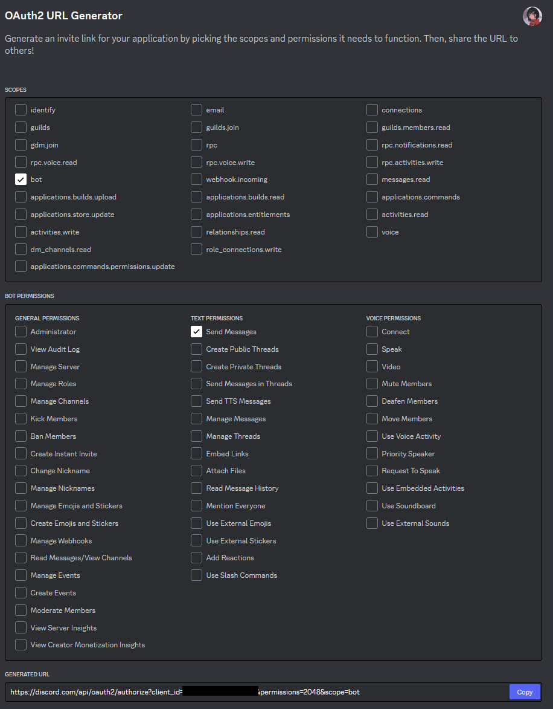
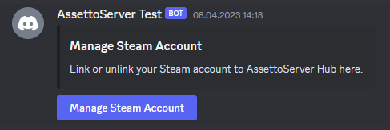
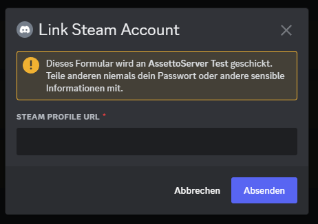
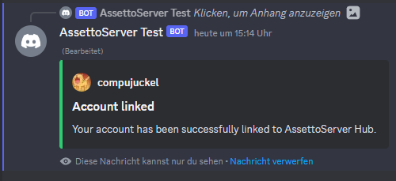

AssettoServer Hub includes a Discord bot with the following features:
* Linking Steam accounts to Discord accounts
* Mapping Discord roles to AssettoServer user groups
* Posting server status in Discord

## Setup
* Visit the [Discord Developer Portal](https://discord.com/developers/applications/) and create a new application. The name you enter will be the initial username of your bot.
* On the left side, click on `Bot`.
* Click on `Add Bot` and confirm.
* Uncheck `Public Bot`.
* Make sure that `Server Members Intent` is checked.

This is what the bot page should look like:

* On the left side, click on `OAuth2` and select `URL Generator`.
* Under `Scopes`, make sure that `bot` is checked.
* Under `Bot Permissions`, make sure that `Send Messages` is checked.

The page should look like this:

* Copy the generated URL at the bottom of the page and paste it into your browser.
* Authorize the bot for your Discord server.
* Go back to the `Bot` page in the Developer Portal.
* Copy your bot token and paste it into your `configuration.yml` like so: `DiscordBotToken: "your token here"`

**That's it!** The next time you start AssettoServer Hub it will connect to Discord.

## Link Steam Accounts
It is recommended to create a new read-only channel for linking Steam accounts.  
In this channel, use the `/steam-link post` command. The bot will now create a post for linking/unlinking Steam accounts:

After clicking the button, users can enter their Steam profile URL:

After entering the Steam profile URL:

### Manage linked Accounts

Administrators can manage linked Steam accounts with the following commands:

* `/steam-link find-discord` - Find Discord user that belongs to a SteamID
* `/steam-link find-steam` - Find SteamID that belongs to a Discord user
* `/steam-link unlink` - Unlink a SteamID from a Discord user

## User Groups

Discord roles can be linked to AssettoServer user groups. This can be used for whitelist, reserved slots, etc.

### Add User Group

Use the `/user-group add` command to create a user group:

In the next step, select the Discord roles for this user group:

After that, the user group will be created:

Now you can use this group in your server configuration.  
For more general info on user groups see [this page](./user-groups).

### Remove User Group

To remove a group simply use the `/user-group remove` command.

## Server Status

tbd