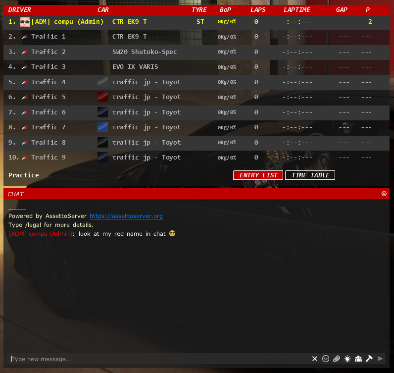

import CodeBlock from '@theme/CodeBlock';
import cfg from "!!raw-loader!./reference/plugin_patreon_chat_roles_cfg.reference.yml";

# PatreonChatRolesPlugin

:::tip

If your community uses a Discord server, check out the [PatreonSocialPlugin](./PatreonSocialPlugin.md) instead!

:::

:::note

Forced minimum CSP version of 0.1.77 (1937) and `EnableClientMessages: true` in `extra_cfg.yml` required!

* Chat colors require CSP 0.1.79 or higher
* Custom icons require CSP 0.1.80-preview218 or higher

:::

Plugin to change chat color of players, add player icons, and optionally add name prefixes or postfixes for them.  
It is advised to use square brackets for name prefixes/postfixes, since it is not possible to join with them normally.

Please see [this page](../assettoserver-hub/user-groups.md) for general information on user groups.

Example with custom icon and red name in chat:



Color and custom icons will be shown in the nametag as well when `New driver tags` is enabled in Content Manager.

## Configuration
Enable the plugin in `extra_cfg.yml`
```yaml title="extra_cfg.yml"
EnablePlugins:
  - PatreonChatRolesPlugin
```

### Reference Configuration
<CodeBlock language="yaml" title="plugin_patreon_chat_roles_cfg.yml">{cfg}</CodeBlock>
