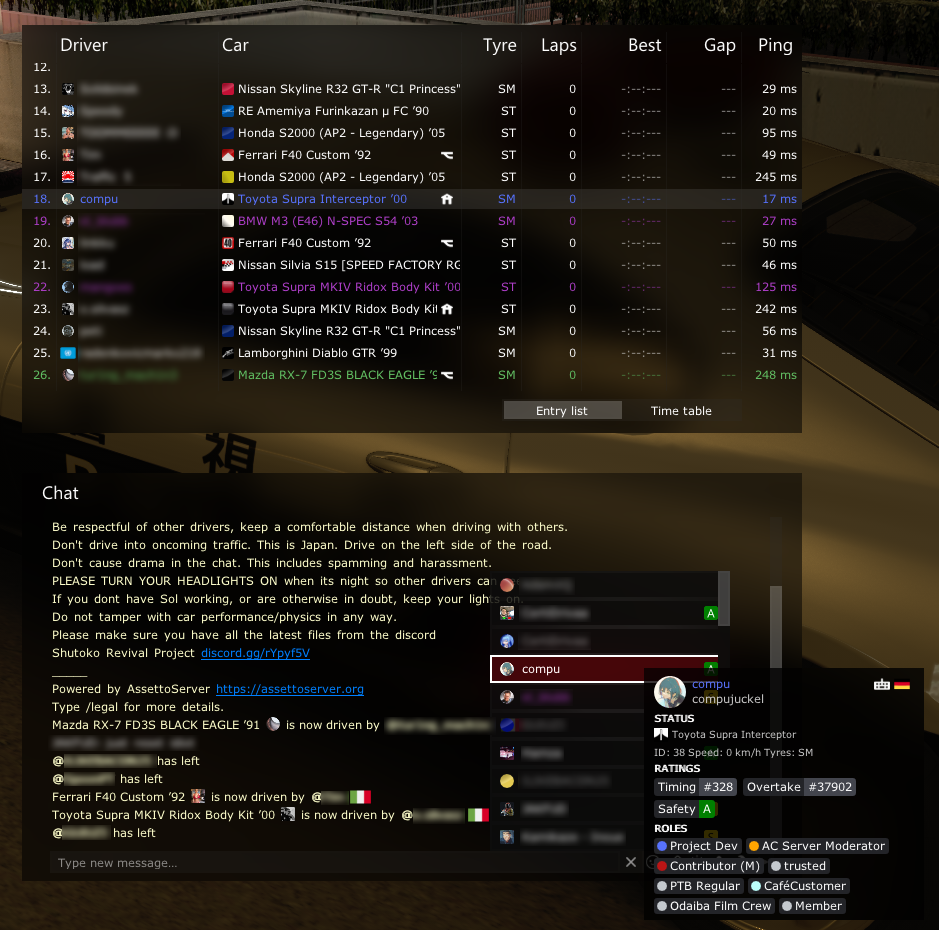
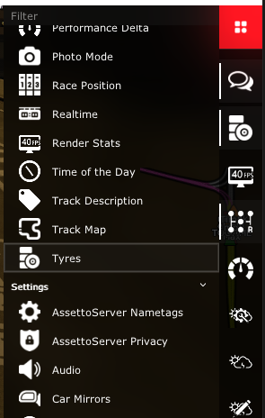
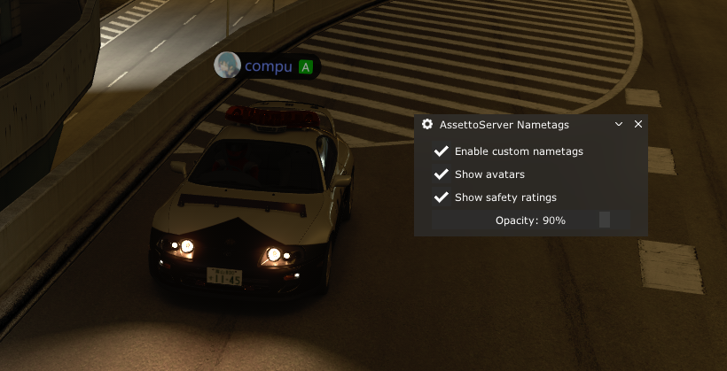

# PatreonSocialPlugin

This plugin provides Discord and Steam user profiles, Discord role integration und profile pictures for your game server.  
It will also show leaderboard positions and safety rating (if those plugins are enabled) and the currently used input method.

:::note

PatreonHubPlugin is required for this plugin to work.

Drivers will need at least CSP 0.2.7 for the plugin to load.

:::



## In-game settings

Settings for this plugin can be accessed from the sidebar on the right.



### AssettoServer Nametags

Drivers can customize nametags to their liking with a small in-game menu. These settings will apply to all servers running PatreonSocialPlugin.



### AssettoServer Privacy

Drivers can choose to hide their Discord and/or Steam profile information. These settings will apply to all servers connected to the same AssettoServer Hub instance.

## Configuration
Enable the plugin in `extra_cfg.yml`
```yaml title="extra_cfg.yml"
EnablePlugins:
  - PatreonHubPlugin
  - PatreonSocialPlugin
```

No further configuration is needed.