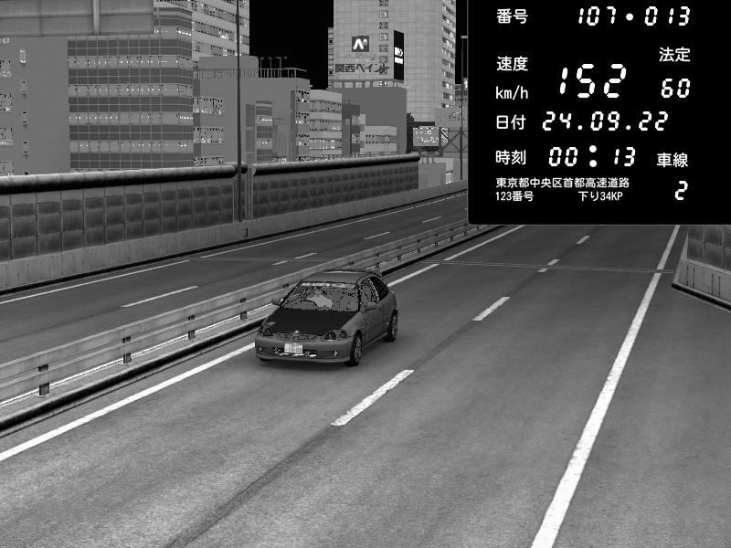

import CodeBlock from '@theme/CodeBlock';
import cfg from "!!raw-loader!./reference/plugin_patreon_speed_trap_cfg.reference.yml";

# PatreonSpeedTrapPlugin
Enables the speed traps on Shutoko Revival Project.  
If a player drives with more than 100km/h trough a speed trap they'll see a red flash and optionally an evidence picture will be sent to a Discord channel.

:::note

Forced minimum CSP version of 0.1.77 (1937) and `EnableClientMessages: true` in `extra_cfg.yml` required!

:::

:::caution

Enabling evidence pictures can lead to lag spikes on clients due to the picture upload!  
Additionally the image processing is taxing on the server CPU. Don't use this if you're running the server on a toaster.

:::



[Map of speed trap locations](./assets/speedtrap-map.jpg) (thanks CaptFingerpaint!)

## Configuration
Enable the plugin in `extra_cfg.yml`
```yaml title="extra_cfg.yml"
EnablePlugins:
  - PatreonSpeedTrapPlugin
```

### Reference Configuration
<CodeBlock language="yaml" title="plugin_patreon_speed_trap_cfg.yml">{cfg}</CodeBlock>

### Custom image overlays

Images can be completely customized using Lua. Source code for the default overlay can be found in the plugin folder `lua/script.lua`.
This plugin uses ImageMagick (or more specifically [Magick.NET](https://github.com/dlemstra/Magick.NET)) to process images.

### Custom Speed Traps

If you want to use this plugin on maps other than SRP it is possible to define custom speed trap locations.  
You can find the values for `Position` and `Forward` the same way as you would for [PatreonTimingPlugin](./PatreonTimingPlugin.mdx).
Camera locations can be found using the in-game Speed Trap debug app. Set `Debug: true` to enable it.
It can be opened via the light bulb in the chat app.

Example speed trap on Imola, at the 300m board of the first corner:
```yaml
CustomSpeedTraps:
  # ID of speed trap
  - Id: 1
    # Position of detection line
    Position: { X: -192.78, Y: -82.89, Z: -426.28 }
    # Forward vector of detection line
    Forward: { X: -195.07, Y: -82.9, Z: -425.97 }
    # Radius around detection point
    RadiusMeters: 10
    # Camera position
    CameraPosition: { X: -202.15, Y: -76.31, Z: -424.98 }
    # Direction of camera
    CameraLook: { X: 0.81, Y: -0.58, Z: -0.05 }
    # Camera FOV
    CameraFov: 60
    # Allowed speed, speed trap will not trigger when speed is below this value
    AllowedSpeedKph: 20
    # Enable red flash
    EnableFlash: true
    # Name of mesh that is turned into a red emissive (optional, when in doubt leave empty)
    MeshName:
```

## Known issues

The plugin will not work when there are non-ASCII characters (Cyrillic etc.) in the server path.
