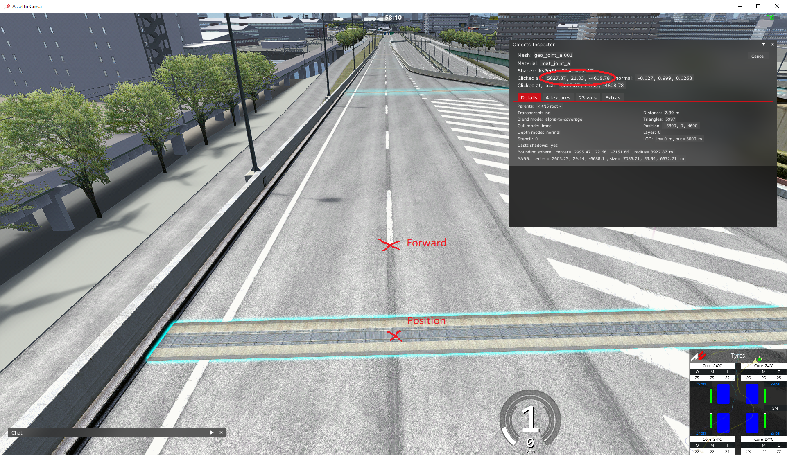
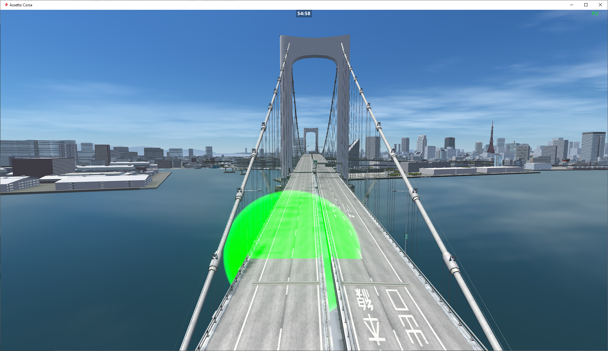

import CodeBlock from '@theme/CodeBlock';
import cfg from "!!raw-loader!./reference/plugin_patreon_timing_cfg.reference.yml";

# PatreonTimingPlugin
This plugin allows you to define multiple timed stages per track. Very useful for large maps like SRP, where no AI spline is loaded on the client.  
Comes with an AssettoServerHub-based leaderboard.

:::note

Forced minimum CSP version of 0.1.77 (1937) and `EnableClientMessages: true` in `extra_cfg.yml` required!

:::

## How to create checkpoints
Each checkpoint needs two coordinates, "Position" and "Forward". Use the Object Inspector app to find coordinates like this:  
  
The checkpoint will be placed on "Position", facing in the direction of "Forward".  

:::caution Direction of a checkpoint is important!

Checkpoints won't trigger if you drive through them from the opposite direction.

:::

After creating checkpoints, you can view them ingame by ticking the "Debug checkpoints" checkbox on the Timing Leaderboard:

Green = Start of a timing zone  
Blue = Checkpoint  
Red = Backside of a checkpoint. Checkpoint won't trigger when coming from this direction  

## Configuration
Enable the plugin in `extra_cfg.yml`
```yaml title="extra_cfg.yml"
EnablePlugins:
  - PatreonTimingPlugin
```

### Example Configuration for SRP
<CodeBlock language="yaml" title="plugin_patreon_timing_cfg.yml">{cfg}</CodeBlock>
