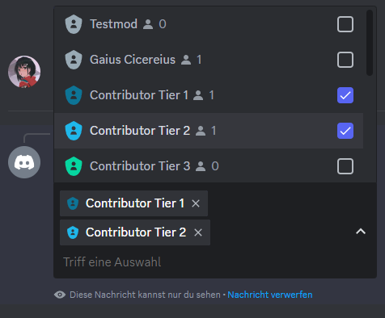
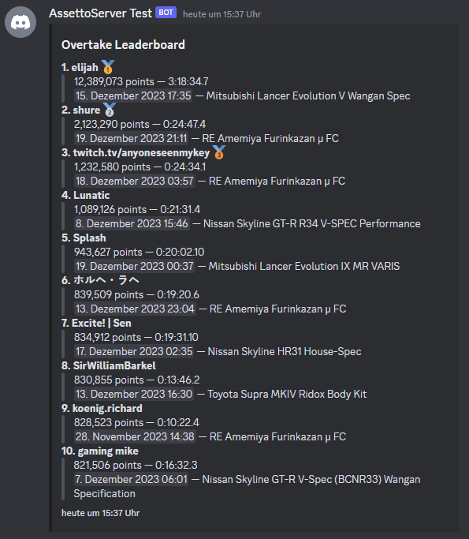

AssettoServer Hub includes a Discord bot with the following features:
* Linking Steam accounts to Discord accounts
* Mapping Discord roles to AssettoServer user groups (example use case: Whitelist based on Discord role)
* Mapping AssettoServer user groups to Discord roles (example use case: Assign role based on Timing Leaderboard)
* Posting server status in Discord

## Setup
* Visit the [Discord Developer Portal](https://discord.com/developers/applications/) and create a new application. The name you enter will be the initial username of your bot.
* On the left side, click on `Bot`.
* Click on `Add Bot` and confirm.
* Uncheck `Public Bot`.
* Make sure that `Server Members Intent` is checked.

This is what the bot page should look like:


* On the left side, click on `OAuth2` and select `URL Generator`.
* Under `Scopes`, make sure that `bot` is checked.
* Under `Bot Permissions`, make sure that `Send Messages` and `Manage Roles` is checked.

The page should look like this:


* Copy the generated URL at the bottom of the page and paste it into your browser.
* Authorize the bot for your Discord server.
* Go back to the `Bot` page in the Developer Portal.
* Copy your bot token and paste it into your `configuration.yml` like so: `DiscordBotToken: "your token here"`

**That's it!** The next time you start AssettoServer Hub it will connect to Discord.

## Link Steam Accounts
It is recommended to create a new read-only channel for linking Steam accounts.  
In this channel, use the `/steam-link post` command. The bot will now create a post for linking/unlinking Steam accounts:


After clicking the button, users can enter their Steam profile URL:


After entering the Steam profile URL:


### Manage linked Accounts

Administrators can manage linked Steam accounts with the following commands:

* `/steam-link find-discord` - Find Discord user that belongs to a SteamID
* `/steam-link find-steam` - Find SteamID that belongs to a Discord user
* `/steam-link unlink` - Unlink a SteamID from a Discord user

## Audit Log

AssettoServer Hub can post some events (linking Steam account, create/delete User Group, ...) to a specific channel. Use the `/audit-log set` command to activate this feature.

## Discord User Groups

Discord roles can be linked to AssettoServer user groups. This can be used for whitelist, reserved slots, etc.

### Add User Group

Use the `/user-group add` command to create a user group:


In the next step, select the Discord roles for this user group:



After that, the user group will be created:


Now you can use this group in your server configuration.  
For more general info on user groups see [this page](./user-groups).

### Remove User Group

To remove a group simply use the `/user-group remove` command.

## User Group Mappings

Existing AssettoServer user groups can be mapped to a Discord role. This can be used for example with [PatreonTimingPlugin](../plugins/PatreonTimingPlugin) to assign roles based on the Timing leaderboard.

### Example: Assign Role based on Timing Leaderboard

First, add a new Timing User Group to your `configuration.yml`:

```yaml title="configuration.yml (AssettoServer Hub)"
TimingUserGroups:
  - Name: timing_top3
    PostFilter: CarRank <= 3
```

This will create a user group called `timing_top3` that contains all players with a Top 3 leaderboard time for any car.

Next, use the `/user-group map` command to map this user group to a Discord role. For example `/user-group map timing_top3 <your role>`:


Now all users with a linked Steam account and a Top 3 leaderboard time will get this role.

<details>
<summary>Custom Timing Filters (Advanced)</summary>
<p>

The criteria for creating Timing roles are fully customizable using SQL WHERE clauses. The following query is executed to determine Timing user groups:

```sql
WITH ranks AS (SELECT tle.player_id,
                      c.model           AS CarModel,
                      tle.created_at    AS CreatedAt,
                      t.name            AS Track,
                      ts.name           AS Stage,
                      MIN(tle.lap_time) AS LapTime,
                      RANK() OVER (
                          PARTITION BY t.track_id, ts.timing_stage_id, tle.car_id
                          ORDER BY tle.lap_time
                          )             AS CarRank,
                      RANK() OVER (
                          PARTITION BY t.track_id, ts.timing_stage_id
                          ORDER BY tle.lap_time
                          )             AS Rank
               FROM timing_leaderboard_entries tle
               JOIN cars c on c.car_id = tle.car_id
               JOIN timing_leaderboards tl on tl.timing_leaderboard_id = tle.timing_leaderboard_id
               JOIN timing_stages ts on ts.timing_stage_id = tle.timing_stage_id
               JOIN tracks t on ts.track_id = t.track_id
              WHERE tle.valid = true
               --#preFilter
               GROUP BY t.name, ts.name, tle.car_id, tle.player_id
               ORDER BY t.name, ts.name, MIN(tle.lap_time))
SELECT DISTINCT r.player_id 
           FROM ranks r 
          --#postFilter
```

The database used is [SQLite](https://www.sqlite.org/lang_select.html).

`PreFilter` and `PostFilter` can be used to customize the resulting user group. For example, the following configuration will create a user group only for lap times set in the current month:

```yaml title="configuration.yml (AssettoServer Hub)"
TimingUserGroups:
  - Name: timing_top5_month
    PreFilter: tle.created_at > date('now', 'start of month')
    PostFilter: CarRank <= 5
```

</p>
</details>

### Example: Assign Role based on Overtake Leaderboard

You can also assign user groups based on the overtake leaderboard. Two examples:

```yaml title="configuration.yml (AssettoServer Hub)"
OvertakeUserGroups:
  - Name: overtake_top100
    PostFilter: Rank <= 100
  - Name: overtake_500k
    PostFilter: Score >= 500000
```

This will create two user groups:
* `overtake_top100` containing the top 100 players
* `overtake_500k` containing all players with at least 500,000 points

Next, use the `/user-group map` command to map this user group to a Discord role. For example `/user-group map overtake_top100 <your role>`.  
Now all users with a linked Steam account and a Top 100 leaderboard time will get this role.

<details>
<summary>Custom Overtake Filters (Advanced)</summary>
<p>

Filtering works similar to the timing leaderboard filtering above. You can use `PreFilter` to filter scores before ranks are being generated, e.g. to only consider scores of the current month.
`PostFilter` can then be used to filter by score, rank, etc.  

List of all column names that can be used as a filter: `Name`, `Leaderboard`, `PlayerId`, `CarModel`, `Score`, `Duration`, `CreatedAt`, `DiscordId`, `Rank`

</p>
</details>

### Example: Assign Role based on Safety Rating

[PatreonSafetyRatingPlugin](../plugins/PatreonSafetyRatingPlugin) can create a user group for each rank, for example:

```yaml title="configuration.yml (AssettoServer Hub)"
SafetyRatingRanks:
- Color: '#00FF00'
  MinimumRating: 4
  Name: A
# highlight-next-line
  UserGroupName: safety_a
- Color: null
  MinimumRating: 1
  Name: B
- Color: '#FF0000'
  MinimumRating: 0
  Name: C
```

This will create a user group called `safety_a` for each driver with an A rating. You can now use `/user-group map safety_a <your role>` to assign a role to all drivers with an A rating.

### Remove Mapping

A mapping can be removed with the `/user-group unmap` command.

## Server Status

AssettoServer Hub can create Server Status messages for your game servers that look like this:


For this, add a new section to your `configuration.yml`, for example:

```yaml title="configuration.yml (AssettoServer Hub)"
DiscordServerStatus:
  # Name that will be used for creating the embed
  srp-eu:
    # Embed title
    Title: Europe - Germany
    # Embed thumbnail
    ThumbnailUrl: https://flagcdn.com/w160/eu.png
    # Embed template - read below for more info
    Template: default
    # Embed color
    Color: "#003399"
    # List of game servers to query
    Servers:
      # Server name
      - Name: EU 1 - No Traffic
        # Server address in format ip:httpPort
        Address: 65.108.176.35:8081
      - Name: EU 2 - Traffic
        Address: 65.108.176.35:8082
      - Name: EU 3 - Traffic - Slow Cars
        Address: 65.108.176.35:8083
      - Name: EU 4 - Traffic
        Address: 65.108.176.35:8085
      - Name: EU PTB - Traffic
        Address: 65.108.176.35:8084
```

The server status message can be posted by using the command `/server-status <name>` in a channel, for example `/server-status srp-eu`.

<details>
<summary>Custom Templates (Advanced)</summary>
<p>

Embeds are customizable using [Scriban templates](https://github.com/scriban/scriban).

AssettoServer Hub includes the following default template:

```
{{ for server in servers }}
**{{ server.alias }}**
{{ if server.online -}}
  :green_circle: Online · Players: `{{ server.clients | string.pad_left 2 }}/{{ server.max_clients | string.pad_left 2 }}` · Time: `{{ server.time }}` · **[Join]({{ server.invite }})**
{{- else -}}
  :red_circle: Offline
{{- end }}
{{ end }}
```

You can add custom templates by adding a `DiscordServerStatusTemplates` section to your `configuration.yml`. Example:

```yaml title="configuration.yml (AssettoServer Hub)"
DiscordServerStatusTemplates:
  emoji: |
    {{ for server in servers }}
    **{{ server.alias }}**
    {{
      if server.online
        fill = server.clients / server.max_clients
        if fill < 0.5
          ":green_circle:"
        else if fill < 0.75
          ":yellow_circle:"
        else
          ":orange_circle:"
        end
        " Online"
      else
        ":red_circle: Offline"
      end
      
      timeSplit = server.time | string.split ":"
      hours = timeSplit[0] | string.to_int
      minutes = timeSplit[1] | string.to_int
      
      if minutes >= 45
        hours += 1
      end
      
      hours = hours % 12
      
      if hours == 0
        hours = 12
      end
      
      if minutes > 15 && minutes < 45
        minutes = 30
      else
        minutes = ""
      end
      
      clockEmoji = ":clock" + hours + minutes + ":" 
    }} · :busts_in_silhouette: `{{ server.clients | string.pad_left 2 }}/{{ server.max_clients | string.pad_left 2 }}` · {{ clockEmoji }} `{{ server.time }}` · **[Join]({{ server.invite }})**
    {{ end }}
```

This template will change color of the green dot depending on the number of players on the server and show the correct time with a clock emoji.

You can then use this template by setting `Template: emoji` in your `DiscordServerStatus` configuration.

Output of the template:


</p>
</details>

## Leaderboards

### Timing Points Leaderboard

Use the `/timing-points-leaderboard` command to create a leaderboard in the current channel.


<details>
<summary>Custom Templates (Advanced)</summary>
<p>

Embeds are customizable using [Scriban templates](https://github.com/scriban/scriban).

AssettoServer Hub includes the following default template:

```
{{ 
func to_emoji(rank)
    case rank
        when 1
            " :first_place:"
        when 2
            " :second_place:"
        when 3
            " :third_place:"
    end
end

func get_mention(entry)
    if entry.discord_id > 0
        " — <@"
        entry.discord_id
        ">"
    end
end

for entry in entries -}}
**{{ for.index + 1 }}\. {{ entry.name }}{{ get_mention entry }}{{ to_emoji for.index + 1 }}**
> {{ entry.points | math.format "#,#" }} points
{{ end }}
```

You can add custom templates by using the following in your `configuration.yml`:

```yaml title="configuration.yml (AssettoServer Hub)"
DiscordTimingPointsLeaderboardTemplates:
  TestTemplate: |
    text of your template
    can be multiple lines
```

The `/timing-points-leaderboard` command includes an optional parameter named `template`. You can use it to specify your custom template (`TestTemplate` in the above example).

</p>
</details>

### Timing Stage Leaderboard

Use the `/timing-stage-leaderboard` command to create a leaderboard in the current channel.


<details>
<summary>Custom Templates (Advanced)</summary>
<p>

Embeds are customizable using [Scriban templates](https://github.com/scriban/scriban).

AssettoServer Hub includes the following default template:

```
{{ 
func to_emoji(rank)
    case rank
        when 1
            " :first_place:"
        when 2
            " :second_place:"
        when 3
            " :third_place:"
    end
end

func get_mention(entry)
    if entry.discord_id > 0
        " — <@"
        entry.discord_id
        ">"
    end
end

func format_duration(duration)
    d = timespan.from_milliseconds duration
    d.minutes | math.format '0'
    ":"
    d.seconds | math.format '00'
    "."
    d.milliseconds | math.format '000'
end

for entry in entries -}}
**{{ for.index + 1 }}\. {{ format_duration entry.lap_time }} — {{ entry.name }}{{ get_mention entry }} {{ to_emoji for.index + 1 }}**
> <t:{{ entry.created_at | date.to_string '%s' }}> — {{ entry.car_display_name }}
{{ end }}
```

You can add custom templates by using the following in your `configuration.yml`:

```yaml title="configuration.yml (AssettoServer Hub)"
DiscordTimingStageLeaderboardTemplates:
  TestTemplate: |
    text of your template
    can be multiple lines
```

The `/timing-stage-leaderboard` command includes an optional parameter named `template`. You can use it to specify your custom template (`TestTemplate` in the above example).

</p>
</details>

### Race Challenge Leaderboard

Use the `/race-challenge-leaderboard` command to create a leaderboard in the current channel.


<details>
<summary>Custom Templates (Advanced)</summary>
<p>

Embeds are customizable using [Scriban templates](https://github.com/scriban/scriban).

AssettoServer Hub includes the following default template:

```
{{ 
func to_emoji(rank)
    case rank
        when 1
            " :first_place:"
        when 2
            " :second_place:"
        when 3
            " :third_place:"
    end
end

func get_mention(entry)
    if entry.discord_id > 0
        " — <@"
        entry.discord_id
        ">"
    end
end

for entry in entries -}}
**{{ for.index + 1 }}\. {{ entry.name }}{{ get_mention entry }}{{ to_emoji for.index + 1 }}**
> {{ entry.rating | math.format "#,#" }} points
{{ end }}
```

You can add custom templates by using the following in your `configuration.yml`:

```yaml title="configuration.yml (AssettoServer Hub)"
DiscordRaceChallengeLeaderboardTemplates:
  TestTemplate: |
    text of your template
    can be multiple lines
```

The `/race-challenge-leaderboard` command includes an optional parameter named `template`. You can use it to specify your custom template (`TestTemplate` in the above example).

</p>
</details>

### Overtake Leaderboard

Use the `/overtake-leaderboard` command to create a leaderboard in the current channel.



<details>
<summary>Custom Templates (Advanced)</summary>
<p>

Embeds are customizable using [Scriban templates](https://github.com/scriban/scriban).

AssettoServer Hub includes the following default template:

```
{{ 
func to_emoji(rank)
    case rank
        when 1
            " :first_place:"
        when 2
            " :second_place:"
        when 3
            " :third_place:"
    end
end

func get_mention(entry)
    if entry.discord_id > 0
        " — <@"
        entry.discord_id
        ">"
    end
end

func format_duration(duration)
    d = timespan.from_milliseconds duration
    d.hours | math.format '0'
    ":"
    d.minutes | math.format '00'
    ":"
    d.seconds | math.format '00'
    "."
    d.milliseconds / 100 | math.round
end

for entry in entries -}}
**{{ for.index + 1 }}\. {{ entry.name }}{{ get_mention entry }}{{ to_emoji for.index + 1 }}**
> {{ entry.score | math.format "#,#" }} points — {{ format_duration entry.duration }}
> <t:{{ entry.created_at | date.to_string '%s' }}> — {{ entry.car_display_name }}
{{ end }}
```

You can add custom templates by using the following in your `configuration.yml`:

```yaml title="configuration.yml (AssettoServer Hub)"
DiscordOvertakeLeaderboardTemplates:
  TestTemplate: |
    text of your template
    can be multiple lines
```

The `/overtake-leaderboard` command includes an optional parameter named `template`. You can use it to specify your custom template (`TestTemplate` in the above example).

</p>
</details>
