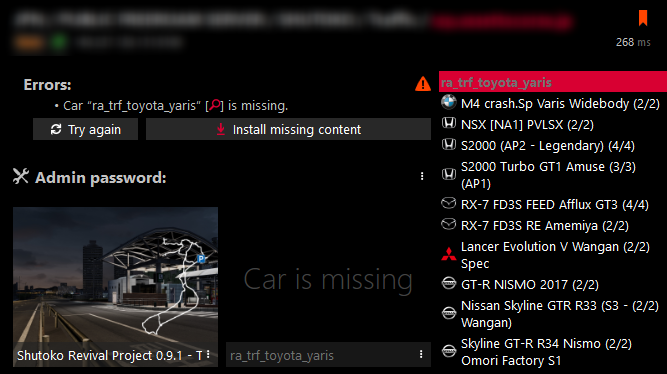

import Tabs from '@theme/Tabs';
import TabItem from '@theme/TabItem';

## How do I get dense traffic?

- Use more traffic slots
- Decrease `MinAiSafetyDistanceMeters` / `MaxAiSafetyDistanceMeters` to make gaps between AI cars smaller
- Depending on how many people are on your server you could increase `AiPerPlayerTargetCount` / `MaxAiTargetCount`

## How do I enable Teleportation?

For teleporting, two things have to be done:

- Requiring a minimum CSP version
- Allowing cars in the entry list to teleport

Depending on if you have the full version of Content Manager or not, there are two different ways to accomplish this:

<Tabs>
<TabItem value="content-manager" label="With Content Manager (Full Version)" default>

  In the `Main` tab of your server check `Require CSP to Join` and enter the desired CSP version ID or click on `Autofill` to insert the version ID of the CSP version you have currently installed:  
  

  Check `Allow teleporting` for each car on your entry list:  
  

</TabItem>
<TabItem value="manual" label="Without Content Manager">

  - In `content/tracks` of your server, create a new folder called `csp`
  - Move your track folder into `content/tracks/csp`
  - In `server_cfg.ini` change the path of your track like this: `TRACK=csp/<CSPversionID>/../<trackname>`, for example `TRACK=csp/2053/../shuto_revival_project_beta`
  - In `data/surfaces.ini` of your track, change `SURFACE_0` to `CSPFACE_0`

    :::caution ONLY CHANGE THE FIRST SURFACE IN THE FILE

      Changing more than `SURFACE_0` will result in checksum errors for clients!

    :::

  - In your `entry_list.ini` add a option to the end of each skin, for example `SKIN=<skinname>/ADAn`

  | Code    | Option                                  |
  | ------- | --------------------------------------- |
  | `/ACA3` | Allow Teleporting                       |
  | `/ABAH` | Allow Color Changing                    |
  | `/ADAn` | Allow both Color Changing & Teleporting |

  This is **NOT** a full list of all codes and options available, just some of the most frequently used ones.
  [Here is how it’s normally generated by Content Manager.](https://github.com/gro-ove/actools/blob/master/AcManager.Tools/Objects/ServerDriverCspOptions.cs#L123)

</TabItem>
</Tabs>

## Where can I find teleport locations for SRP?

Either use the [official SRP teleports](<https://raw.githubusercontent.com/C1XTZ/AssettoServer-CommunityReleases/main/Shutoko%20Revival%20Project/Teleport%20Locations/Shutoko%20Revival%20Project%20(Official).txt>) or make some yourself.

## How do I make my own teleports locations?

You can use the Objects Inspector or the [comfy map app](https://www.racedepartment.com/downloads/comfy-map.52623/) to determine the coordinates and heading.  
The formating is as follows:

```ini
POINT_0 = Name               ; destination name
POINT_0_GROUP = Group Name   ; optional group
POINT_0_POS = X, Y, Z        ; coordinates
POINT_0_HEADING = 0          ; heading angle in degrees
```

**Having the comfy map app is not necessary to create points, enable or use teleportation!**

## How do I enable Color Changing?

:::caution

Pick only one of these two options!

:::

```ini
[CUSTOM_COLOR]
ALLOW_IN_PITS = 1      ; change car colors only in the pits of the track.
ALLOW_EVERYWHERE = 1   ; change car colors anywhere as long as the car is stopped.
```

If AI cars are allowed to change their colors everywhere they will spawn in random colors if possible.  
**Keep in mind that you still need to allow cars to change colors via the entry list even if you're using `ALLOW_EVERYWHERE`.**

## How do I increase the speed in the pits?

```ini
[PITS_SPEED_LIMITER]
KEEP_COLLISIONS = 0    ; will either activate or deactivate collisions between cars in the pits.
SPEED_KMH = 80         ; the maximum speed allowed, the default is 80.
```

[There are more options available here.](https://github.com/ac-custom-shaders-patch/acc-extension-config/wiki/Misc-%E2%80%93-Server-extra-options#pit-speed-limiter-settings)

## How do I allow people to download missing content?

It's possible to allow people to download missing content like tracks and cars in the Content Manager server browser.  


:::caution

Please use the download links the authors of the content you're using provide unless you're explicitly allowed to reupload them for yourself.

:::

<Tabs>
<TabItem value="content-manager" label="With Content Manager" default>

  - Navigate to the `Details` Tab in your Server preset.
  - In the `Share Mode` tab select "Download URL" and paste the direct download link into the `Download from` field.
  - Leave `Version Required` as it is since CM will autofill these for you, then save the preset.
  

</TabItem>
<TabItem value="manual" label="Without Content Manager">

  - Navigate to the `cfg` folder of your server.
  - Create a `cm_content` folder and in that folder a file named `content.json`.
  - In `content.json` you can now configure download links like so:

  ```json
  {
    "cars": {
      "car_name_here": {
        "url": "download url here",
        "version": "version here"
      },
      "car_name_two": {
        "url": "download url here",
        "version": "version here"
      }
    },
    "track": {
      "url": "download url here",
      "version": "version here"
    }
  }
  ```

  - The `version` has to match the version shown in the `Author` field in the content tab of the car/track.
  

</TabItem>
</Tabs>

## Where can I find the CSP version IDs?

The easiest way to get the ID for the CSP Version you're using is opening Content Manager and navigating to `Settings > Custom Shaders Patch > About & Updates` and then reading the Currently active Shaders Patch version ID.  


If you need the ID of a version you currently don't have installed [the Offical CSP Website](https://acstuff.ru/patch/) also has the IDs in the `Other Versions` sections.

