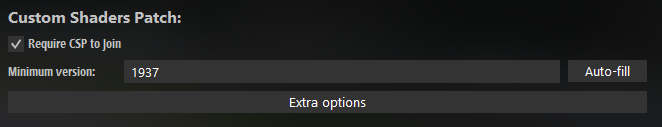
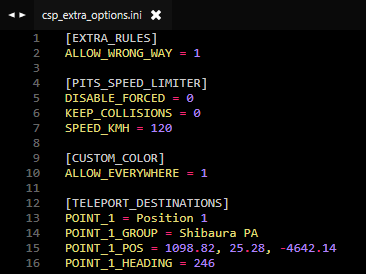

import Tabs from '@theme/Tabs';
import TabItem from '@theme/TabItem';

## How do I get dense traffic? {#dense-traffic}

- Add more cars to the `entry_list.ini` that are used as traffic. This is the most important setting. It is pretty much impossible to achieve high traffic density with just 10 traffic cars, for example.
- Decrease `MinAiSafetyDistanceMeters` / `MaxAiSafetyDistanceMeters` to make gaps between AI cars smaller  
  **Don't set it lower than ~12m or you might experience AI cars braking immediately after spawning!**
- Depending on how many people are on your server you could increase `AiPerPlayerTargetCount` / `MaxAiTargetCount`

## Why can't I drive certain cars on my server? {#locked-cars}

Certain car mods are designed to only be driven on servers that are whitelisted by the creators of the car mod.  
Affected cars usually do not respond to the gas pedal input if they are used on other servers.  
This restriction is built into the car mod itself and cannot be deactivated by any means.  
Please note that these restrictions are not a feature of AssettoServer.

## Why am I spawning in a different location than expected? {#spawn-locations}

Where you spawn depends on where the pit for each index is located for track and layout that you chose.  
For example, the Main Layout of Shutoko Revival Project combines 170 pits into a single layout.  
Because of that, it is possible to spawn in different locations depending on the index that each car has in the `entry_list.ini`.  
Here is a short list of which indices correspond to which spawn location for the Shutoko Revival Project - Main Layout.

| Car Indices                | Spawn Location            |
| -------------------------- | ------------------------- |
| `[CAR_0]`   to `[CAR_39]`  | Tatsumi PA                |
| `[CAR_40]`  to `[CAR_61]`  | Yoyogi PA                 |
| `[CAR_62]`  to `[CAR_81]`  | Heiwajima PA - Northbound |
| `[CAR_82]`  to `[CAR_157]` | Heiwajima PA - Southbound |
| `[CAR_158]` to `[CAR_169]` | Daishi PA                 |

:::caution

It is not possible to skip or have duplicate indices in `entry_list.ini`.  
This means that you cannot start your entry list with `[CAR_82]` to have all cars spawn in Heiwajima, or have multiple `[CAR_0]` entries to have more than 40 cars spawn in Tatsumi.  

:::

## Why am I stuck on "Initialising AI spline" during loading? {#initialising-aispline}

Your game is loading the singleplayer AI spline that is in your local game files, which is not needed for freeroam servers.  

If your server is using a singleplayer traffic layout, for example `Shutoko Revival Project - Shibaura PA Traffic`, use the regular version of the layout instead. 

Otherwise rename the `ai` folder from the tracks layout folder in your game files to `ai_off`.    
By default: `C:\Program Files (x86)\Steam\steamapps\common\assettocorsa\content\tracks\<trackname>\<layoutname>\ai`  
If the track has no layouts it will be in the track folder instead.

:::note

Renaming the `ai` folder will remove the ability to use AI for that specific layout in singleplayer.  
It wil also disable some client side penalty systems like track cuts.  
If you ever want to use AI in singleplayer or these penalties again, simple rename the `ai_off` folder back to `ai`.

:::

## How do I remove checksums? {#remove-checksums}

:::caution

Only remove checksums if you're okay with users cheating.  
Checksums are required to prevent people from cheating by modifying their car and track data.  
Remove them at your own risk.

:::

<Tabs>
<TabItem value="cars" label="Car Checksums" default>

  - Navigate to the `\content\cars` folder on your server.
  - Remove the `data.acd` in the folder of every car that you want to use without checksums.
  - Set `MissingCarChecksums: true` in `extra_cfg.yml` and restart the server.
  - If you've done everything correctly you should no longer see a `Added checksum for car_name` log message for the car you removed. If you've removed the checksum of all cars it should also log `Initialized 0 car checksums`.

</TabItem>
<TabItem value="tracks" label="Track Checksums">

  - Navigate to the `\content\tracks\<track>\<layout>\data` (or `\content\tracks\csp\<track>\<layout>\data` if you're requiring a CSP version.) and `\system` folders on your server.
  - Remove both of the `surfaces.ini` files and restart the server.
  - If you've done everything correctly you should see the log message saying `Initialized 0 track checksums`

</TabItem>
</Tabs>

If you added any other checksums like track kn5's or car colliders, also remove those files.

## How do I add missing track params? {#adding-trackparams}

You can either add the parameters locally or ignore this error by setting `MissingTrackParams` to `true` in `extra_cfg.yml`.  
Keep in mind that setting `MissingTrackParams` to `true` can result in time not being synchronized between players and the server.  

<Tabs>
<TabItem value="new" label="Create New" default>

Navigate to the `cfg` folder of the server and open the `data_track_params.ini`.  
Go to the bottom of the file and add a section for your track using the folder name of your track as the header like this:

```ini title="data_track_params.ini"
[shuto_revival_project_beta_ptb]
NAME=SRP PTB
LATITUDE=
LONGITUDE=
TIMEZONE=
```

Open [Google Maps](https://www.google.com/maps/) and find the location of the track.  
Right click onto the map and click the Longitute and Latitute values that will be shown as the first option to copy them.  

  

Paste them after the `LATITUDE=` and `LONGITUDE=` keys.

Open a [TZ timezone list](https://en.wikipedia.org/wiki/List_of_tz_database_time_zones) and look for the time zone that the track is in, then copy the `TZ Identifier`.

  

Paste it after the `TIMEZONE=` key.

You should now have something along the lines of this:

```ini title="data_track_params.ini"
[shuto_revival_project_beta_ptb]
NAME=SRP PTB
LATITUDE=35.67040
LONGITUDE=139.74085
TIMEZONE=Asia/Tokyo
```

</TabItem>
<TabItem value="reuse" label="Reuse Existing" default>

Navigate to the `cfg` folder of the server and open the `data_track_params.ini`.  
Find and copy the entry for the track you want to reuse.  
Change the header of the copied section to the folder name your current track.  

```ini title="data_track_params.ini"
; Original
[shuto_revival_project_beta]
NAME=SRP
LATITUDE=35.670479
LONGITUDE=139.740921
TIMEZONE=Asia/Tokyo
; Copied
[shuto_revival_project_beta_ptb]
NAME=SRP PTB
LATITUDE=35.670479
LONGITUDE=139.740921
TIMEZONE=Asia/Tokyo
```

</TabItem>
</Tabs>

Save and close the file, open `extra_cfg.yml` and set `ForceServerParams` to `true`.  
Please also adjust the CSP version you're requiring if needed.

```yaml title="extra_cfg.yml"
# Force clients to use track params (coordinates, time zone) specified on the server. CSP 0.1.79+ required
ForceServerTrackParams: true
```

## How do I use CSP extra server options? {#csp-extra-options}

#### Requiring a minimum CSP Version {#requiring-csp-version}

<Tabs groupId="content-manager">
<TabItem value="content-manager" label="With Content Manager (Full Version)" default>

  In the `Main` tab, enable `Require CSP to Join` and enter the desired CSP version ID or click on `Autofill` to insert the version ID of the CSP version you have currently installed:  
  
  

</TabItem>
<TabItem value="manual" label="Without Content Manager">

  - In `content/tracks` of your server, create a new folder called `csp`
  - Move your track folder into `content/tracks/csp`
  - In `server_cfg.ini` change the path of your track like this: `TRACK=csp/<CSPversionID>/../<trackname>`  
    For example: `TRACK=csp/2053/../shuto_revival_project_beta`
  - In `data/surfaces.ini` of your track, change `SURFACE_0` to `CSPFACE_0`

    :::caution ONLY CHANGE THE FIRST SURFACE IN THE FILE

      Changing more than `SURFACE_0` will result in checksum errors for clients!

    :::

</TabItem>
</Tabs>

<details>
<summary>**Where can I find CSP version IDs?**</summary>
<p>

In Content Manager, navigate to `Settings > Custom Shaders Patch > About & Updates` and look for the Currently active Shaders Patch version ID.


If you need the ID of a version you currently don't have installed **[the official CSP Website](https://acstuff.ru/patch/)** lists the IDs in the `Other Versions` sections.


</p>
</details>

#### Adding CSP extra server options to the server {#extra-options-ini}

Depending on if you have the full version of Content Manager or not, there are two different ways to accomplish this:

<Tabs groupId="content-manager">
<TabItem value="content-manager" label="With Content Manager (Full Version)" default>

  Click the `Folder` button at the bottom of the preset page and create a file called `csp_extra_options.ini`. 

  

</TabItem>
<TabItem value="manual" label="Without Content Manager">

  Navigate to the `cfg` folder of the server and create a file called `csp_extra_options.ini`. 

</TabItem>
</Tabs> 

[This CSP wiki page](https://github.com/ac-custom-shaders-patch/acc-extension-config/wiki/Misc-%E2%80%93-Server-extra-options) has a long list of options you can use.  
The options on that page go into the `csp_extra_options.ini`, for example:

 

#### Allowing extra options via the entry list {#allowing-extra-options}

Some features like Teleportation and Color Changing require you to allow cars to use them in the entry list.  

<Tabs groupId="content-manager">
<TabItem value="content-manager" label="With Content Manager (Full Version)" default>

  Click the `CSP` button and enable the features you want to allow for the car:  

  

</TabItem>
<TabItem value="manual" label="Without Content Manager">

  - In your `entry_list.ini` add a code to the end of each skin, for example:
  
  ```ini title="entry_list.ini"
  [CAR_0]
  MODEL=carname
  SKIN=skinname/ADAn
  ```

  | Code    | Option                                  |
  | ------- | --------------------------------------- |
  | `/ACA3` | Allow Teleportation                     |
  | `/ABAH` | Allow Color Change                      |
  | `/ADAn` | Allow both Teleportation & Color Change |

<details>
<summary>All Option Combinations</summary>
<p>**[How Content Manager generates them.](https://github.com/gro-ove/actools/blob/master/AcManager.Tools/Objects/ServerDriverCspOptions.cs#L123)**</p>
<p>

| Code    | Options                                                                                         |
| ------- | ----------------------------------------------------------------------------------------------- |
|         | None                                                                                            |
| `/AAEW` | Block Keyboard                                                                                  |
| `/AAIV` | Block Joystick                                                                                  |
| `/AAQT` | Block Steering Wheel                                                                            |
| `/AAgf` | Force Headlights                                                                                |
| `/ABAH` | Allow Color Change                                                                              |
| `/ACA3` | Allow Teleportation                                                                             |
| `/AAMU` | Block Keyboard, Block Joystick                                                                  |
| `/AAUS` | Block Keyboard, Block Steering Wheel                                                            |
| `/AAYR` | Block Joystick, Block Steering Wheel                                                            |
| `/AAke` | Block Keyboard, Force Headlights                                                                |
| `/AAod` | Block Joystick, Force Headlights                                                                |
| `/AAwb` | Block Steering Wheel, Force Headlights                                                          |
| `/ABEG` | Block Keyboard, Allow Color Change                                                              |
| `/ABIF` | Block Joystick, Allow Color Change                                                              |
| `/ABQD` | Block Steering Wheel, Allow Color Change                                                        |
| `/ABgP` | Force Headlights, Allow Color Change                                                            |
| `/ACE2` | Block Keyboard, Allow Teleportation                                                             |
| `/ACI1` | Block Joystick, Allow Teleportation                                                             |
| `/ACQz` | Block Steering Wheel, Allow Teleportation                                                       |
| `/ACg/` | Force Headlights, Allow Teleportation                                                           |
| `/ADAn` | Allow Color Change, Allow Teleportation                                                         |
| `/AAsc` | Block Keyboard, Block Joystick, Force Headlights                                                |
| `/AA0a` | Block Keyboard, Block Steering Wheel, Force Headlights                                          |
| `/AA4Z` | Block Joystick, Block Steering Wheel, Force Headlights                                          |
| `/ABME` | Block Keyboard, Block Joystick, Allow Color Change                                              |
| `/ABUC` | Block Keyboard, Block Steering Wheel, Allow Color Change                                        |
| `/ABYB` | Block Joystick, Block Steering Wheel, Allow Color Change                                        |
| `/ABkO` | Block Keyboard, Force Headlights, Allow Color Change                                            |
| `/ABoN` | Block Joystick, Force Headlights, Allow Color Change                                            |
| `/ABwL` | Block Steering Wheel, Force Headlights, Allow Color Change                                      |
| `/ACM0` | Block Keyboard, Block Joystick, Allow Teleportation                                             |
| `/ACUy` | Block Keyboard, Block Steering Wheel, Allow Teleportation                                       |
| `/ACYx` | Block Joystick, Block Steering Wheel, Allow Teleportation                                       |
| `/ACk+` | Block Keyboard, Force Headlights, Allow Teleportation                                           |
| `/ACo9` | Block Joystick, Force Headlights, Allow Teleportation                                           |
| `/ACw7` | Block Steering Wheel, Force Headlights, Allow Teleportation                                     |
| `/ADEm` | Block Keyboard, Allow Color Change, Allow Teleportation                                         |
| `/ADIl` | Block Joystick, Allow Color Change, Allow Teleportation                                         |
| `/ADQj` | Block Steering Wheel, Allow Color Change, Allow Teleportation                                   |
| `/ADgv` | Force Headlights, Allow Color Change, Allow Teleportation                                       |
| `/ABsM` | Block Keyboard, Block Joystick, Force Headlights, Allow Color Change                            |
| `/AB0K` | Block Keyboard, Block Steering Wheel, Force Headlights, Allow Color Change                      |
| `/AB4J` | Block Joystick, Block Steering Wheel, Force Headlights, Allow Color Change                      |
| `/ACs8` | Block Keyboard, Block Joystick, Force Headlights, Allow Teleportation                           |
| `/AC06` | Block Keyboard, Block Steering Wheel, Force Headlights, Allow Teleportation                     |
| `/AC45` | Block Joystick, Block Steering Wheel, Force Headlights, Allow Teleportation                     |
| `/ADMk` | Block Keyboard, Block Joystick, Allow Color Change, Allow Teleportation                         |
| `/ADUi` | Block Keyboard, Block Steering Wheel, Allow Color Change, Allow Teleportation                   |
| `/ADYh` | Block Joystick, Block Steering Wheel, Allow Color Change, Allow Teleportation                   |
| `/ADku` | Block Keyboard, Force Headlights, Allow Color Change, Allow Teleportation                       |
| `/ADot` | Block Joystick, Force Headlights, Allow Color Change, Allow Teleportation                       |
| `/ADwr` | Block Steering Wheel, Force Headlights, Allow Color Change, Allow Teleportation                 |
| `/ADss` | Block Keyboard, Block Joystick, Force Headlights, Allow Color Change, Allow Teleportation       |
| `/AD0q` | Block Keyboard, Block Steering Wheel, Force Headlights, Allow Color Change, Allow Teleportation |
| `/AD4p` | Block Joystick, Block Steering Wheel, Force Headlights, Allow Color Change, Allow Teleportation |

</p>
</details>

</TabItem>
</Tabs>  

### How do I allow driving the wrong way? {#wrong-way}

This is also used to remove the incorrectly displayed wrong way indicator on tracks like Shutoko Revival Project.  
If you want to make sure that people drive the correct way after adding this setting, use the [AutoModerationPlugin.](./plugins/AutoModerationPlugin.md)

```ini title="csp_extra_options.ini"
[EXTRA_RULES]
ALLOW_WRONG_WAY = 1 
```

If you get teleported back to pits, rename the `ai` folder from the track layout folder in your local game files to `ai_off`.  
By default: `C:\Program Files (x86)\Steam\steamapps\common\assettocorsa\content\tracks\<trackname>\<layoutname>\ai`    

### How do I enable Teleportation? {#teleportation}

For teleporting, two things have to be done:

- Allowing cars in the entry list to teleport, [explained here.](#allowing-extra-options)
- Adding teleport destinations to the `csp_extra_options.ini`

If done correctly you should have a `Teleport to...` option in the chat app extras:  


#### Where can I find teleport locations for SRP? {#srp-teleports}

Either use the teleports used on the official SRP servers below or make some yourself.  

<details>
<summary>**Official Shutoko Revival Project Teleport locations**</summary>
<p>Last updated: 2024-09-14</p>
<p>

```ini title="csp_extra_options.ini"
[TELEPORT_DESTINATIONS]
POINT_0 = Position 1
POINT_0_POS = 1098.8,25.3,-4642.1
POINT_0_HEADING = 246
POINT_0_GROUP = Shibaura PA

POINT_1 = Position 2
POINT_1_POS = 1098.8,25.3,-4649.8
POINT_1_HEADING = 245
POINT_1_GROUP = Shibaura PA

POINT_2 = Position 3
POINT_2_POS = 1098.9,25.3,-4657.4
POINT_2_HEADING = 246
POINT_2_GROUP = Shibaura PA

POINT_3 = Position 4
POINT_3_POS = 1099.4,25.3,-4664.9
POINT_3_HEADING = 246
POINT_3_GROUP = Shibaura PA

POINT_4 = Position 5
POINT_4_POS = 1099.2,25.3,-4672.4
POINT_4_HEADING = 245
POINT_4_GROUP = Shibaura PA

POINT_5 = Position 1
POINT_5_POS = 5862.1,23.3,-4649
POINT_5_HEADING = 267
POINT_5_GROUP = Tatsumi PA

POINT_6 = Position 2
POINT_6_POS = 5850.9,22.9,-4644.6
POINT_6_HEADING = 268
POINT_6_GROUP = Tatsumi PA

POINT_7 = Position 3
POINT_7_POS = 5839.7,22.5,-4640
POINT_7_HEADING = 268
POINT_7_GROUP = Tatsumi PA

POINT_8 = Position 1
POINT_8_POS = -308.6,15.5,6143.8
POINT_8_HEADING = 68
POINT_8_GROUP = Daishi PA

POINT_9 = Position 2
POINT_9_POS = -308.5,15.5,6150.7
POINT_9_HEADING = 68
POINT_9_GROUP = Daishi PA

POINT_10 = Position 3
POINT_10_POS = -308.1,15.4,6157.9
POINT_10_HEADING = 66
POINT_10_GROUP = Daishi PA

POINT_11 = Position 1
POINT_11_POS = -230.1,12.3,1360
POINT_11_HEADING = 104
POINT_11_GROUP = Heiwajima PA North

POINT_12 = Position 2
POINT_12_POS = -234.9,12.3,1354.1
POINT_12_HEADING = 106
POINT_12_GROUP = Heiwajima PA North

POINT_13 = Position 3
POINT_13_POS = -239.8,12.3,1348.1
POINT_13_HEADING = 105
POINT_13_GROUP = Heiwajima PA North

POINT_14 = Position 1
POINT_14_POS = 964.9,6.7,-126.1
POINT_14_HEADING = 156
POINT_14_GROUP = Oi PA

POINT_15 = Position 2
POINT_15_POS = 964.9,6.8,-138
POINT_15_HEADING = 156
POINT_15_GROUP = Oi PA

POINT_16 = Position 3
POINT_16_POS = 964.8,6.8,-151.2
POINT_16_HEADING = 156
POINT_16_GROUP = Oi PA

POINT_17 = Position 1
POINT_17_POS = -10854.3,12,13422.8
POINT_17_HEADING = 287
POINT_17_GROUP = Mirai - Kinko JCT

POINT_18 = Position 2
POINT_18_POS = -10846.2,12,13415.8
POINT_18_HEADING = 283
POINT_18_GROUP = Mirai - Kinko JCT

POINT_19 = Position 1
POINT_19_POS = -83.8,7.1,10983.1
POINT_19_HEADING = 273
POINT_19_GROUP = Bayshore North - Kawasaki Port

POINT_20 = Position 2
POINT_20_POS = -103,7.7,10993.2
POINT_20_HEADING = 274
POINT_20_GROUP = Bayshore North - Kawasaki Port

POINT_21 = Position 1
POINT_21_POS = 2512.1,12.2,-9223.3
POINT_21_HEADING = 231
POINT_21_GROUP = C1 Outer - Edobashi JCT

POINT_22 = Position 2
POINT_22_POS = 2503.3,12,-9225.6
POINT_22_HEADING = 232
POINT_22_GROUP = C1 Outer - Edobashi JCT

POINT_23 = Position 1
POINT_23_POS = -4251.7,32.9,-10032.5
POINT_23_HEADING = 208
POINT_23_GROUP = Shinjuku Station

POINT_24 = Position 2
POINT_24_POS = -4244.1,32.9,-10016.8
POINT_24_HEADING = 159
POINT_24_GROUP = Shinjuku Station

POINT_25 = Position 3
POINT_25_POS = -4242.9,33,-9995.6
POINT_25_HEADING = 160
POINT_25_GROUP = Shinjuku Station

POINT_26 = Position 1
POINT_26_POS = -6147.9,29.6,13722.3
POINT_26_HEADING = 346
POINT_26_GROUP = Yokohama - Daikoku

POINT_27 = Position 2
POINT_27_POS = -6151.9,29.7,13702.2
POINT_27_HEADING = 347
POINT_27_GROUP = Yokohama - Daikoku

POINT_28 = Position 1
POINT_28_POS = -135.8,6.6,1475.1
POINT_28_HEADING = 128
POINT_28_GROUP = Heiwajima PA - South

POINT_29 = Position 2
POINT_29_POS = -141.2,6.6,1463.3
POINT_29_HEADING = 132
POINT_29_GROUP = Heiwajima PA - South

POINT_30 = Position 3
POINT_30_POS = -146.6,6.5,1451.8
POINT_30_HEADING = 130
POINT_30_GROUP = Heiwajima PA - South

POINT_31 = Position 2
POINT_31_POS = 2179.8,-1.7,-7541.2
POINT_31_HEADING = 291
POINT_31_GROUP = C1 Inner - Ginza

POINT_32 = Position 1
POINT_32_POS = 4104.2,-7.8,8489
POINT_32_HEADING = 304
POINT_32_GROUP = Bayshore North - Tamagawa River Tunnel

POINT_33 = Position 2
POINT_33_POS = 4121,-8.3,8463.5
POINT_33_HEADING = 303
POINT_33_GROUP = Bayshore North - Tamagawa River Tunnel

POINT_34 = Position 1
POINT_34_POS = 3278.4,0.8,4292.5
POINT_34_HEADING = 197
POINT_34_GROUP = Bayshore South - Haneda Airport

POINT_35 = Position 2
POINT_35_POS = 3265.1,0.7,4278.1
POINT_35_HEADING = 199
POINT_35_GROUP = Bayshore South - Haneda Airport

POINT_36 = Position 1
POINT_36_POS = -7478.1,13,16477.6
POINT_36_HEADING = 22
POINT_36_GROUP = Kariba - Sakuragicho

POINT_37 = Position 1
POINT_37_POS = 767.5,16.5,-9914.9
POINT_37_HEADING = 87
POINT_37_GROUP = C1 Inner - Kitanomaru

POINT_38 = Position 2
POINT_38_POS = 782.8,16.5,-9921.3
POINT_38_HEADING = 89
POINT_38_GROUP = C1 Inner - Kitanomaru

POINT_39 = Position 1
POINT_39_POS = 4522.3,14,-8210.6
POINT_39_HEADING = 350
POINT_39_GROUP = Belt Inner - Fukuzumi

POINT_40 = Position 2
POINT_40_POS = 4524.7,14.3,-8199.7
POINT_40_HEADING = 349
POINT_40_GROUP = Belt Inner - Fukuzumi

POINT_41 = Position 1
POINT_41_POS = -2533.6,11,8864.5
POINT_41_HEADING = 86
POINT_41_GROUP = Yokohane - Kawasaki

POINT_42 = Position 1
POINT_42_POS = 1371.3,9.8,-6547.1
POINT_42_HEADING = 117
POINT_42_GROUP = C1 Outer - Bayshore Access

POINT_43 = Position 2
POINT_43_POS = 1363.8,9.7,-6537.6
POINT_43_HEADING = 118
POINT_43_GROUP = C1 Outer - Bayshore Access

POINT_44 = Position 1
POINT_44_POS = 318,13,-5719.1
POINT_44_HEADING = 63
POINT_44_GROUP = C1 Outer - Shibakoen

POINT_45 = Position 2
POINT_45_POS = 305.9,12.8,-5720.3
POINT_45_HEADING = 61
POINT_45_GROUP = C1 Outer - Shibakoen

POINT_46 = Position 1
POINT_46_POS = -2171.6,36.8,-6448
POINT_46_HEADING = 72
POINT_46_GROUP = Shibuya - Takigicho

POINT_47 = Position 2
POINT_47_POS = -2159.5,36.8,-6449.3
POINT_47_HEADING = 73
POINT_47_GROUP = Shibuya - Takigicho

POINT_48 = Position 1
POINT_48_POS = -4581.4,34.7,-6013.5
POINT_48_HEADING = 80
POINT_48_GROUP = Shibuya Access

POINT_49 = Position 2
POINT_49_POS = -4754.6,34.7,-5830
POINT_49_HEADING = 12
POINT_49_GROUP = Shibuya Access

POINT_50 = Position 1
POINT_50_POS = -4305.1,36.8,-8883.1
POINT_50_HEADING = 176
POINT_50_GROUP = Yoyogi PA

POINT_51 = Position 2
POINT_51_POS = -4313.3,36.7,-8883.1
POINT_51_HEADING = 174
POINT_51_GROUP = Yoyogi PA

POINT_52 = Position 3
POINT_52_POS = -4324.5,36.7,-8882.3
POINT_52_HEADING = 174
POINT_52_GROUP = Yoyogi PA

POINT_53 = Position 1
POINT_53_POS = 100.3,12.2,-5830.6
POINT_53_HEADING = 191
POINT_53_GROUP = C1 Inner - Shibakoen

POINT_54 = Position 2
POINT_54_POS = 92.5,12.2,-5841.1
POINT_54_HEADING = 193
POINT_54_GROUP = C1 Inner - Shibakoen

POINT_55 = Position 1
POINT_55_POS = 550.8,12.4,-3796.7
POINT_55_HEADING = 133
POINT_55_GROUP = Yokohane South - Shinagawa

POINT_56 = Position 1
POINT_56_POS = -7075.9,32.9,16318.3
POINT_56_HEADING = 351
POINT_56_GROUP = Bayshore North - Honmoku JCT

POINT_57 = Position 2
POINT_57_POS = -7079,33.2,16306.4
POINT_57_HEADING = 351
POINT_57_GROUP = Bayshore North - Honmoku JCT

POINT_58 = Service Station 1
POINT_58_POS = 1672.2,12.6,-7998.5
POINT_58_HEADING = 96
POINT_58_GROUP = Yaesu

POINT_59 = Service Station 2
POINT_59_POS = 1699,12.4,-8024.1
POINT_59_HEADING = 120
POINT_59_GROUP = Yaesu

POINT_60 = Service Station 3
POINT_60_POS = 1606.8,12.7,-7968.5
POINT_60_HEADING = -96
POINT_60_GROUP = Yaesu

POINT_61 = Service Station 4
POINT_61_POS = 1595.9,12.7,-7964.8
POINT_61_HEADING = -96
POINT_61_GROUP = Yaesu

```

</p>
</details>

#### How do I make my own teleport locations? {#making-teleports}

You can use the Objects Inspector or the [comfy map app](https://www.racedepartment.com/downloads/comfy-map.52623/) to determine the coordinates and heading.  
The formating is as follows:

```ini
POINT_0 = Name               ; Destination name
POINT_0_GROUP = Group Name   ; Optional group
POINT_0_POS = X, Y, Z        ; Coordinates
POINT_0_HEADING = 0          ; Heading angle in degrees
```

:::note

The comfy map app is not required to create points, enable or use teleportation.

:::

### How do I enable Color Changing? {#color-changing}

For Color Changing, two things have to be done:

- Allowing cars in the entry list to change colors, [explained here](#allowing-extra-options)
- Adding the following to the `csp_extra_options.ini`

Keep in mind that this only works for cars with regular skins, liveries using textures will not be affected.

```ini title="csp_extra_options.ini"
[CUSTOM_COLOR]
ALLOW_EVERYWHERE = 1   ; Change car colors anywhere as long as the car is stopped.
```

:::note

If AI cars are allowed to, they will spawn in random colors. 

:::

### How do I increase the speed in the pits? {#pit-speed-limiter}

```ini title="csp_extra_options.ini"
[PITS_SPEED_LIMITER]
KEEP_COLLISIONS = 0   ; Activate collisions between cars in pits
SPEED_KMH = 80        ; Alter pits speed limiter value; default is 80
```

### How do I use Server Scripts? {#csp-server-scripts}

:::note

Keep in mind that server scripts are different from AssettoServer Plugins, and we don’t provide support for them on our Discord.

:::

You're going to need to host your script in plaintext somewhere publicly accessible, for example:
  - Github / Pastebin
  - Your own media server (like IIS or others)
  - **DO NOT HOST ON DISCORD**

```ini title="csp_extra_options.ini"
[SCRIPT_...]
SCRIPT = "https://pastebin.com/raw/00000000000"    ; Change this to the url of your script
```

[There are more options available here.](https://github.com/CheesyManiac/cheesy-lua/wiki/Extra-CSP-Server-Config-Values#server-scripts)

## How do I allow players to download missing content? {#download-missing-content}

It's possible to allow players to download missing content like tracks and cars in the Content Manager server browser.


:::caution

Please use the download links the authors of the content you're using provide unless you're explicitly allowed to reupload them for yourself.

:::

<Tabs>
<TabItem value="content-manager" label="With Content Manager (Full Version)" default>

  - Navigate to the `Details` Tab in your Server preset.
  - In the `Share Mode` tab select "Download URL" and paste the direct download link into the `Download from` field.
  - Leave `Version Required` as it is since CM will autofill these for you, then save the preset.
  - A `content.json` file will be created in the `cm_content` folder under the directory of the server. 
  
  :::caution

  The `cm_content` folder does not get included when using the packing feature and has to be manually copied.

  :::

  

</TabItem>
<TabItem value="manual" label="Without Content Manager">

  - Navigate to the `cfg` folder of your server.
  - Create a `cm_content` folder and in that folder a file named `content.json`.
  - In `content.json` you can now configure download links like so:

  ```json
  {
    "cars": {
      "car_name_here": {
        "url": "download url here",
        "version": "version here"
      },
      "car_name_two": {
        "url": "download url here",
        "version": "version here"
      }
    },
    "track": {
      "url": "download url here",
      "version": "version here"
    }
  }
  ```

  - The `version` has to match the version shown in the `Author` field in the content tab of the car/track.  
    If the mod has no version, simply remove the `"version": "version here"` line.

  

</TabItem>
</Tabs>

## How can I enable a Custom Steam API Replacement? {#custom-steam-api}
**AssettoServer does not support piracy and as such there is no way around buying Assetto Corsa and the DLC's required by the content you want to use.**  
If you used a pirated version of Assetto Corsa in the past and have since purchased everything, make sure to:  
- Verify your game files via Steam
- Change the Assetto Corsa game folder in the Content Manager general settings to your Steam installation.  
By default: `C:\Program Files (x86)\Steam\steamapps\common\assettocorsa\`

## How can I format my server description? {#server-description}

**Linebreaks**  
The `|-` modifier is probably the most important part to properly format your description.  
Read this site for more information: https://yaml-multiline.info/

**BBcode**  
The description in Content Manager uses BBcode tags, read: https://www.bbcode.org/reference.php  
To add images use `[img=<link>]img1[/img]`  
Keep in mind that some functions of BBcode are not supported by Content Manager.

**Example Description, do not add this to the bottom of the `extra_cfg.yml`.**

```yaml title="extra_cfg.yml"
# Server description shown in Content Manager. EnableServerDetails must be on
ServerDescription: |-
  [img=https://assettoserver.org/img/as-logo-cm.png]AssettoServer Logo[/img]

  [size=16]                   [b]UNOFFICIAL AI TRAFFIC TEST SERVER[/b]

                Car and track downloads, installation help:
                          [url=https://discord.com/invite/shutokorevivalproject]Shutoko Revival Project Discord[/url]
                              Server news and feedback:
                      [url=https://discord.gg/uXEXRcSkyz]AssettoServer Development Discord[/url]
                                    [color=#FF424D]Support the server:[/color]
                                              [url=https://www.patreon.com/assettoserver]Patreon[/url]
  [size=22][b]Rules[/b][/size]
  [color=#E82A1F][size=18][b]- Keep chat app open at all times.[/b][/size][/color]
  [size=18][color=#E82A1F][b]- [u]PLEASE TURN YOUR LIGHTS ON[/u][size=16]
    when its night so other drivers can see you.[/size][/b][/color][/size]
  - Don't run into other cars on purpose.
  - Do not park or block the road.
    Pull off as much to the side as possible or return to pits.
  - Be respectful of other drivers, keep a comfortable distance
    when driving with others.
  - Don't drive into oncoming traffic. This is Japan.
    Drive on the left side of the road.
  - Don't cause drama in the chat. This includes spamming and
    harassment.
  - If you dont have Sol working, or are otherwise in doubt,
    keep your lights on.
```
