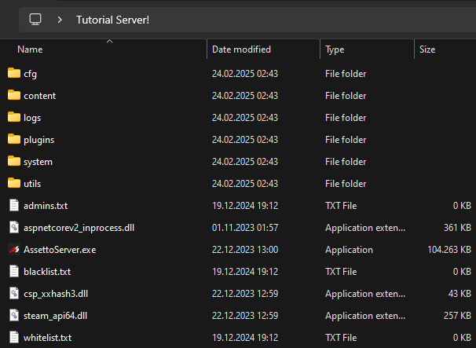

import Tabs from '@theme/Tabs';
import TabItem from '@theme/TabItem';

## Introduction {#intro}

This page will guide you through the initial setup process of setting up your own free-roam AssettoServer on a Windows machine.  
We will be setting up our server in a dedicated folder outside of Content Manager, going over how to configure AI traffic, how to use a few settings to customize the server and learning how to troubleshoot some of the more common causes of server crashes.

## Prerequisites {#prerequisites}

To follow along you will need the following things:

- The **latest** version of AssettoServer.
- The **full version** of Content Manager.
- The **Shutoko Revival Project** track.
- A `fast_lane.ai(p)` made for **Shutoko Revival Project**.
- Basic understanding of how text editors work.

### Downloading the latest version of AssettoServer {#latest-assettoserver-version}

1. On the [installation section of the introduction page](./intro.mdx#installation) follow the **latest stable release** link.
   
   

2. Click on the `assetto-server-win-x64.zip` in the Assets section of the release to download the file.
   
   

### Purchasing the Full Version of Content Manager {#content-manager-fullversion}

:::note
You can host, configure, and play on the server without the full version of Content Manager. However, for the sake of simplicity, we will be using features of the full version.
:::

1. Purchase the full version of Content Manager via the [official website](https://assettocorsa.club/content-manager.html) or by being a patron of [x4fabs Patreon](https://www.patreon.com/user?u=11605034).

2. Enter the key you received via email into Content Manager.
   
   

### Downloading the Shutoko Revival Project track and AI spline {#downloading-srp}

:::note
You can use any track that you have a `fast_lane.ai(p)` for.  
In this guide, we will use the SRP track as it is one of the most popular tracks.
:::

1. Join the [Shutoko Revival Project Discord](https://discord.com/invite/shutokorevivalproject)

2. Follow their download and installation instructions. **If you need help with that, please use the [#help](https://discord.com/channels/500246817833877505/504100944846520321) channel**

3. Join the AssettoServer Discord by clicking on the Discord logo in the navbar of this page.  
   
   

4. Go into the [#ai-spline-releases](https://discord.com/channels/890676433746268231/929390922624532480) channel, scroll up until you find the spline made for Shutoko Revival Project and download it by clicking on the `fast_lane.aip` file.
   
   

## Initial Setup {#initial-setup}

### Preconfiguration {#preconfiguration}

For now, we will be using the minimum amount of cars needed for the default traffic settings of AssettoServer.  
**If we wanted to have more player and/or traffic cars we would adjust steps 4 and 6 accordingly.** 

1. Start by navigating to the `Server` tab of Content Manager  
   If you do not have this Menu enable it in the Content Manager settings like so:
   
   

2. Click on `SERVER_00` in the list on the left and then on the `SERVER_00` text field to change the name of the server.
   
   

3. Click on the track preview image of Imola and change the track to Shutoko Revival Project - Tatsumi PA.
   
   

4. Move the `Capacity` slider to 11.

5. Click on the `Admin password` field and enter a password that is at least 8 characters long.

6. Click on the `ENTRY LIST` tab and click on the (+) to add cars to the list.  
   Add the following cars in this order:

   - 1 RUF CTR Yellowbird
   - 5 Audi S1
   - 5 Toyota GT-86

   

   :::caution
   Only add as many cars to the entry list as there are pits available for the track and layout you've chosen.  
   The limit is displayed below the `Capacity` slider and for Shutoko Revival Project - Tatsumi PA looks like this:  

   

   Ignoring this limit will result in the game crashing when joining the server.
   :::

7. Click on the `RULES` tab and configure the page how you see fit.

   Some recommendations:

   - Uncheck `Virtual Mirror` as this forces the Virtual Mirror to be on at all times, which can be undesired.
   - Move the `Allowed tyres out` slider to the left into the `Any` position.

   I will be using the following settings:
   
   

8. Click on the `CONDITIONS` tab and configure the page how you see fit.  
   Don't worry too much about the `Time` slider yet, we will get to that later on.

   :::caution
   Do not use the WeatherFX Time, Time Multiplier or Date.  
   They do not work with AssettoServer and could cause problems.
   :::

   I will be using the following settings:
   
   

9. Click on the `SESSIONS` tab and configure it as follows:

   - Check `Pickup mode` and `Loop mode` while leaving `Locked entry list in pickup mode` unchecked.
   - Uncheck `Booking`, `Qualifying` and `Race`.
   - Set `Practice` to something reasonable like 2 hours. You can make sessions longer than that but a length of 999999999 will likely cause problems and is not necessary.

   We will be using the following settings:  

   

10. At the bottom of the preset, click on `Save`.  
    
    

### Packing the server preset {#preset-packing}

Now that we're done configuring the server, we can use the packing feature to export all files we need into a .zip file for us.

1. In the same bar that we just saved the server preset, click on `Pack`.

2. Select `Windows` as the target and uncheck `Include executable` and `Pack into single exe-file`.

3. Click on `Pack` and save it.  
   
   

### Extracting AssettoServer and the packed preset {#server-extraction}

You should now have the following .zip files somewhere:

- `assetto-server-win-x64.zip`
- The server preset we just packed, called something like `Tutorial Server!-X-XXXXXXXX-XXXXXX.zip`

Create a new folder and extract both of these two .zip files into it.



### First launch and basic AssettoServer traffic configuration {#first-launch-traffic-basics}

Start the server by double-clicking `AssettoServer.exe`.

You might get the following pop up messages from Windows Firewall or Windows Defender:

<Tabs>
<TabItem value="firewall" label="Windows Firewall" default>

   

</TabItem>
<TabItem value="defender" label="Windows Defender">

   

</TabItem>
</Tabs>

After allowing the `AssettoServer.exe` to launch, you should see something along the lines of this:


:::caution
  You might also have the following error message inside of your log:  
  `Error during Kunos lobby registation: ERROR, INVALID SERVER, CHECK YOUR PORT FORWARDING SETTINGS`  

  This means that you need to forward the ports that AssettoServer uses inside your router and possibly make a  exception for the `AssettoServer.exe` inside your firewall.  
  By default the ports you need to forward are TCP+UDP `9600` and TCP `8081`.  

  Because there are an infinite amount of routers / ISP combinations we will not explain how to do this here.  
  Refer to the user manual of your router or google for "how to port forward" with the name of your router and ISP.
:::

1. Close the console and navigate to the `cfg` folder inside the server's main folder.

2. Open the `extra_cfg.yml` using a text editor of your choice.  
   Because we've selected a WeatherFX weather earlier and our goal is to have AI traffic set these two options to `true`:

   ```yaml title="extra_cfg.yml"
   # Enable new CSP weather handling. Allows rain and smooth weather transitions. Requires CSP 0.1.76+
   EnableWeatherFx: true

   # Enable AI traffic
   EnableAi: true
   ```

3. Save and close the file and then open the `entry_list.ini`.  
   For the first car, which should be the RUF that we want to drive, we will add a line below `RESTRICTOR=0`.

   ```ini title="entry_list.ini"
   [CAR_0]
   MODEL=ruf_yellowbird
   SKIN=00_yellowbird_black
   SPECTATOR_MODE=0
   DRIVERNAME=
   TEAM=
   GUID=
   BALLAST=0
   RESTRICTOR=0
   // highlight-next-line
   AI=none
   ```

   For the remaining cars we will add the line `AI=fixed` instead since we want to use them as AI traffic.

   ```ini title="entry_list.ini"
   [CAR_1]
   MODEL=ks_audi_a1s1
   SKIN=00_sepang_blue_pearl_effect_br
   SPECTATOR_MODE=0
   DRIVERNAME=
   TEAM=
   GUID=
   BALLAST=0
   RESTRICTOR=0
   // highlight-next-line
   AI=fixed
   ```

4. Save and close the file and then open the `server_cfg.ini`.  
   Find the `[PRACTICE]` session and add a line with `INFINITE=1` to it.

   ```ini title="server_cfg.ini"
   [PRACTICE]
   NAME=Practice
   TIME=120
   IS_OPEN=1
   // highlight-next-line
   INFINITE=1
   ``` 

   This will make the session infinitely long without resetting the session and sending everyone to pits when the 2 hours are up.  
   Keep in mind that Content Manager and apps will show a `time left`, which is normal and doesn't mean that it's not working.

5. After saving and closing the file, navigate to the content folder of the track, which is `\content\tracks\shuto_revival_project_beta`. Create a new folder called `ai` and place the `fast_lane.aip` we downloaded earlier inside of it.
   
   

6. Now go back into the main folder of the server and launch `AssettoServer.exe` again.  
   Then open Content Manager and go to the `Drive` tab, select the `Online` tab and then the `LAN` tab.  
   The server should now appear in the server list. It may take a few moments, so you might need to refresh the list a few times.
   
   

7. Select the RUF, click `Join` and drive out of the pits to start spawning AI traffic.

8. Other people should also be able to join the server by searching for it or via the invite link that you can copy from the console.
   
   :::caution
   Do not click the Invite button to copy the invite link, it will copy your local IP which is useless to people outside of your local network. Use the link that is generated in the console instead.
   :::

## Advanced Server Configuration {#advanced-server-config}

### Time of Day {#changing-time}

Earlier we skipped over the `Time` slider inside of Content Manager because it only allows us to set the time inside a range of 08:00 to 18:00 (8AM to 6PM) and it would reset to this range regardless of what we do.  
So what do we do if we wanted to have a Night only server?

1. Navigate to the `cfg` folder of the server and open the `server_cfg.ini` with a text editor of your choice.

2. Under `[SERVER]` find the parameter `SUN_ANGLE`.  
   Use the following formula: `16*((HOURS*3600)+(MINUTES*60)+SECONDS-46800)/(50400-46800)`  
   For example, for 00:00 you would do `16*((0*3600)+(0*60)+0-46800)/(50400-46800)` which will result in `SUN_ANGLE=-208`

3. Since we already set the time multiplier to 0 we don't need to change it. If you wanted to, this would be the `TIME_OF_DAY_MULT` parameter. `1` would result in time progressing as fast as in real life, `2` would be twice as fast as in real life and so on.

4. Save and restart the server to apply the changes.
   
   :::note
   If you have a specific time you want the server to be on, you might need to use trial and error to get the `SUN_ANGLE` just right.
   :::

### Weather {#changing-weather}

:::caution if you want to select a weather with rain
All players will need to have a Custom Shaders Patch preview version installed to see rain.  
Rain does not come with Sol or Pure. Rain is part of the paid preview versions of Custom Shaders Patch.  
Purchase Custom Shaders Patch previews on [x4fabs Patreon](https://www.patreon.com/user?u=11605034).
:::

1. Navigate to the `cfg` folder of the server and open the `server_cfg.ini` with a text editor of your choice.  

2. Find the `[WEATHER_0]` section, it should look something like this:

   ```ini title="server_cfg.ini"
   [WEATHER_0]
   // highlight-next-line
   GRAPHICS=sol_03_scattered_clouds_type=17
   BASE_TEMPERATURE_AMBIENT=18
   BASE_TEMPERATURE_ROAD=6
   VARIATION_AMBIENT=0
   VARIATION_ROAD=0
   WIND_BASE_SPEED_MIN=0
   WIND_BASE_SPEED_MAX=0
   WIND_BASE_DIRECTION=0
   WIND_VARIATION_DIRECTION=0
   ```

3. Under `[WEATHER_0]` find the parameter `GRAPHICS=` and change the WeatherFX ID after `_type=` to the ID of the weather you want.  
   [Here](./misc/wfx-types.md) you can find a list of available WeatherFX type IDs.  
   For example, to change the starting weather to be `Heavy Rain` instead of `Scattered Clouds`, it would look like this:

   ```ini title="server_cfg.ini"
   [WEATHER_0]
   GRAPHICS=sol_03_scattered_clouds_type=8
   ```

   If you just want Rain graphics without the physics you can add the following to your `csp_extra_options.ini`
   ```ini title="csp_extra_options.ini"
   [EXTRA_RULES] 
   DISABLE_RAIN_PHYSICS=1
   ```

4. Save and restart the server to apply the changes.

### CSP Extra Server Options {#csp-server-options}

If we want to take advantage of some of the features that CSP provides for servers, we will need to make some changes and create a file inside our `cfg` folder.

If you feel like you don't need a step-by-step explanation, read over the [FAQ section](./faq.md#csp-extra-options) that covers how to use them.  

#### Requiring a minimum CSP Version {#requiring-csp-version}

1.  Navigate to the `content/tracks` of the server and create a new folder called `csp`.

2.  Take and move the `shuto_revival_project_beta` folder inside of the `csp` folder we just created.
    
    

3.  Go back into the `cfg` folder and open the `server_cfg.ini` the `TRACK=` parameter line as follows:  
    `TRACK=csp/<CSPversionID>/../<trackname>`, in this case `TRACK=csp/2144/../shuto_revival_project_beta`.

    The version ID `2144` will mean that in order to join the server, players will need to have **at least** CSP version 1.79 installed.  
    If you want to require a different CSP version and don't know how where to get the ID from, read this [FAQ section](./faq.md#requiring-csp-version).

4.  Save and close the file and navigate to the `\content\tracks\csp\shuto_revival_project_beta\tatsumi_pa\data` folder of the server and open the `surfaces.ini`.  
    Change the name of the first surface from `SURFACE_0` to `CSPFACE_0`
    
    :::caution
    Changing any surface other than `SURFACE_0` will result in checksum errors for clients!
    :::

5.  Save and close the file and restart the server, if you did everything correctly the server should start without any errors.

We are now ready to create a file called `csp_extra_options.ini` inside the `cfg` folder of our server and start adding to it.  
The [CSP Wiki](https://github.com/ac-custom-shaders-patch/acc-extension-config/wiki/Misc-%E2%80%93-Server-extra-options) has a long list of options and settings you can play around with.  
Two of the more useful options for Freeroam servers are listed below.

```ini title="csp_extra_options.ini"
 [EXTRA_RULES]
 ALLOW_WRONG_WAY = 1   ; Allow cars to drive either way, gets rid of the wrong way sign on some tracks

 [PITS_SPEED_LIMITER]
 DISABLE_FORCED = 0    ; Disable forced pits speed limiter
 KEEP_COLLISIONS = 0   ; Activate collisions between cars in pits
 SPEED_KMH = 120       ; Alter pits speed limiter value; default is 80
```

#### Extra steps for teleportation and color changing {#csp-extra-steps}

For teleportation and color changing there are additional steps:

1. Navigate to the `cfg` folder and open the `entry_list.ini`.

2. Each car has a `SKIN=` line that needs to be edited to allow that car to use these features.  
   The following codes need to be added to the skin line:

   | Code    | Usage                                   |
   | ------- | --------------------------------------- |
   | `/ACA3` | Allow Teleporting                       |
   | `/ABAH` | Allow Color Changing                    |
   | `/ADAn` | Allow both Color Changing & Teleporting |

   This is **NOT** a full list of all codes and options available, just some of the most frequently used ones.

   Meaning, if we wanted to use teleportation and color changing it would look like this:

   ```ini title="entry_list.ini"
   [CAR_0]
   MODEL=ruf_yellowbird
   // highlight-next-line
   SKIN=00_yellowbird_black/ADAn
   ```

   If we wanted to also allow our AI cars to spawn in different colors, we would have to at least add `/ABAH` to each of the car's skin lines since we don't care about teleportation for them.

3. Now we are ready to add the required options to our `csp_extra_options.ini` file inside the `cfg` folder.

   So, with color changing and teleportation the file looks like this:

   ```ini title="csp_extra_options.ini"
   [EXTRA_RULES]
   ALLOW_WRONG_WAY = 1   ; Allow cars to drive either way, gets rid of the wrong way sign on some tracks

   [PITS_SPEED_LIMITER]
   DISABLE_FORCED = 0    ; Disable forced pits speed limiter
   KEEP_COLLISIONS = 0   ; Activate collisions between cars in pits
   SPEED_KMH = 120       ; Alter pits speed limiter value; default is 80

   [CUSTOM_COLOR]
   ALLOW_EVERYWHERE = 1   ; change car colors anywhere as long as the car is stopped.

   [TELEPORT_DESTINATIONS]
   POINT_1 = Position 1
   POINT_1_GROUP = Shibaura PA
   ...
   ```

   You can find the teleports used on the Official Shutoko Revival Projects servers in this [FAQ Section](./faq.md#srp-teleports)

4. Save and close the file and restart the server, you should now have traffic that is randomly colored and be able to teleport / change your car color via the lightbulb in the chat app.  
   
   

### AssettoServer Plugins {#enabling-plugins}

AssettoServer comes with a few free to use plugins, we will be going over how to enable and configure two of them.  
Namely the [AutoModerationPlugin](./plugins/AutoModerationPlugin.md) and the [RandomWeatherPlugin](./plugins/RandomWeatherPlugin.md).  
If you feel like you don't need a step-by-step explanation, read over their respective documentation pages which cover what they do and how to enable and configure them.

:::caution
Please make sure to not add or remove any spaces when copy pasting configurations as improper indentation will result in the server refusing to start!
:::

#### AutoModerationPlugin

1. Go to the AutoModerationPlugin documentation page and scroll down to the [Configuration section](./plugins/AutoModerationPlugin.md#configuration).

2. Navigate to the `cfg` folder of the server and open the `extra_cfg.yml`.

3. Find `EnablePlugins: []` and enable the plugin as explained on the page like so:
   ```yaml title="extra_cfg.yml"
   # List of plugins to enable
   EnablePlugins:
     - AutoModerationPlugin
   ```

4. Go back to the documentation page and copy the codeblock for the configuration.  
   To make sure you copied everything you can use the copy button on the right of the codeblock.  

   

5. Paste the configuration **at the bottom** of the `extra_cfg.yml` like so:
   ```yaml title="extra_cfg.yml"
   # Apply scale to some traffic density related settings. Increasing this DOES NOT magically increase your traffic density, it is dependent on your other settings. Values higher than 1 not recommended.
   TrafficDensity: 1
   # Tyre diameter of AI cars in meters, shouldn't have to be changed unless some cars are creating lots of smoke.
   TyreDiameterMeters: 0.65
   ---
   !AutoModerationConfiguration
   # Kick players driving without lights during the night
   NoLightsKick:
     # Set to false to disable
     Enabled: true
     # Time after the player gets kicked. A warning will be sent in chat after half this time
     DurationSeconds: 60
     # Players driving slower than this speed will not be kicked
     MinimumSpeedKph: 20
   # Kick players driving the wrong way. AI has to enabled for this to work
   WrongWayKick:
     # Set to false to disable
     Enabled: true
     # Time after the player gets kicked. A warning will be sent in chat after half this time
     DurationSeconds: 20
     # Players driving slower than this speed will not be kicked
     MinimumSpeedKph: 20
   # Kick players blocking the road. AI has to be enabled for this to work
   BlockingRoadKick:
     # Set to false to disable
     Enabled: true
     # Time after the player gets kicked. A warning will be sent in chat after half this time
     DurationSeconds: 30
     # Players driving faster than this speed will not be kicked
     MaximumSpeedKph: 5
   ```

6. We will also set `EnableClientMessages` to true because if enabled, a wrong way / no parking / no lights sign will be shown to the player.
   ```yaml title=extra_cfg.yml
   # Enable CSP client messages feature. Requires CSP 0.1.77+
   EnableClientMessages: true
   ```

   If we wanted to we could now adjust the plugin config, we will be leaving it as is for now.

#### RandomWeatherPlugin

1. Go to the RandomWeatherPlugin documentation page and scroll down to the [Configuration section](./plugins/RandomWeatherPlugin.md#configuration).

2. Navigate to the `cfg` folder of the server and open the `extra_cfg.yml`.

3. Find `EnablePlugins:` and enable the plugin as explained on the page like so:
   ```yaml title="extra_cfg.yml"
   # List of plugins to enable
   EnablePlugins:
     - AutoModerationPlugin
     - RandomWeatherPlugin
   ```
4. Go back to the documentation page and copy the codeblock for the configuration.

5. Paste the configuration below the AutoModerationConfiguration like so:

   ```yaml title="extra_cfg.yml"
   ---
   !AutoModerationConfiguration
   # Kick players driving without lights during the night
   NoLightsKick:
     # Set to false to disable
     Enabled: true
     # Time after the player gets kicked. A warning will be sent in chat after half this time
     DurationSeconds: 60
     # Players driving slower than this speed will not be kicked
     MinimumSpeedKph: 20
   # Kick players driving the wrong way. AI has to enabled for this to work
   WrongWayKick:
     # Set to false to disable
     Enabled: true
     # Time after the player gets kicked. A warning will be sent in chat after half this time
     DurationSeconds: 20
     # Players driving slower than this speed will not be kicked
     MinimumSpeedKph: 20
   # Kick players blocking the road. AI has to be enabled for this to work
   BlockingRoadKick:
     # Set to false to disable
     Enabled: true
     # Time after the player gets kicked. A warning will be sent in chat after half this time
     DurationSeconds: 30
     # Players driving faster than this speed will not be kicked
     MaximumSpeedKph: 5
   ---
   !RandomWeatherConfiguration
   # Weights for random weather selection, setting a weight to 0 blacklists a weather, default weight is 1.
   WeatherWeights:
     LightThunderstorm: 2.0
     Thunderstorm: 0.0
     Hurricane: 0.5
   # Minimum duration until next weather change
   MinWeatherDurationMinutes: 15
   # Maximum duration until next weather change
   MaxWeatherDurationMinutes: 60
   # Minimum weather transition duration
   MinTransitionDurationSeconds: 180
   # Maximum weather transition duration
   MaxTransitionDurationSeconds: 600
   ```

   With the default configuration of the plugin, `LightThunderstorm` would be twice as likely to be selected as other weathers, `Thunderstorm` would never be selected and `Hurricane` would be half as likely to be selected.  
   Weathers not listed in this list will be defaulted to `1` as is explained in the comment above the `WeatherWeights`.

6. We will now edit the `WeatherWeights` to only allow for `Clear`, `FewClouds`, `ScatteredClouds`, `BrokenClouds` and `OvercastClouds` like so:
   ```yaml title="extra_cfg.yml"
   ---
   !RandomWeatherConfiguration
   # Weights for random weather selection, setting a weight to 0 blacklists a weather, default weight is 1.
   WeatherWeights:
     Mist: 0
     Haze: 0
     LightThunderstorm: 0
     Thunderstorm: 0
     Hurricane: 0
     HeavyThunderstorm: 0
     Drizzle: 0
     LightDrizzle: 0
     HeavyDrizzle: 0
     LightRain: 0
     Rain: 0
     HeavyRain: 0
     LightSnow: 0
     Snow: 0
     HeavySnow: 0
     LightSleet: 0
     Sleet: 0
     HeavySleet: 0
     Fog: 0
     Smoke: 0
     Sand: 0
     Dust: 0
     Squalls: 0
     Tornado: 0
     Hurricane: 0
     Cold: 0
     Hot: 0
     Windy: 0
     Hail: 0
   # Minimum duration until next weather change
   MinWeatherDurationMinutes: 15
   # Maximum duration until next weather change
   MaxWeatherDurationMinutes: 60
   # Minimum weather transition duration
   MinTransitionDurationSeconds: 180
   # Maximum weather transition duration
   MaxTransitionDurationSeconds: 600
   ```

7. Save and close the file and restart the server.  
   If you did everything correctly you should see two new lines at the beginning of the server log:  

   

This covers how to enable and configure plugins.  
You can add as many or as few plugins, just make sure you carefully read the documentation pages as some of them might conflict with each other.

### Troubleshooting Basics {#troubleshooting}

If at some point something goes wrong and the server no longer starts properly, there a few way to figure out what went wrong and how to fix it.
We will be looking at one of the more common reasons for a server crash in this example but learning what to look for can help you figure out how to fix any problem.

:::note
If the console window just closes when you try to start the server there will always be a log file you can read!  
And if there is no log generated you have more than likely installed a wrong version or bundle of the .NET Runtime.
:::

Logs will be generated in the `logs` folder of the server.
To open the log file, it should be called something like `log-20230706.txt` with the part after `log-` being the date the log was written.

Before I continue I want to explain a few thing that can be useful to cut down on how much you have to read in order to understand.  
Each line in the log will have some information in the beginning: `YEAR-MONTH-DAY HR:MIN:SEC.MILS TIMEZONE(+/- UTC) [TYPE]`  
We only really care about the type and actual message, so here is a little cheatsheet:

| Message Type    | Meaning                                                                             |
| --------------- | ----------------------------------------------------------------------------------- |
| `[DBG]`         | Debug, can be ignored                                                               |
| `[INF]`         | Information, can also be ignored                                                    |
| `[WRN]`         | Warning, might be important but can usually be ignored as well                      |
| `[ERR]`         | Error, an error the server can recover from and keep running.                       |
| `[FTL]`         | Fatal, an error causing the server to terminate.                                    |

While `[INF]`, `[DBG]` and `[WRN]` might have hints for other problems, in our example we will focus on the `[ERR]` and `[FTL]` messages.

#### Example #1 - Missing AI spline {#missing-aispline}

Now, I want you to look at the log in the image below and try to read the log until you find something that might give you a idea about what is causing the server to crash.  


At first this might seem like a lot of scary text and that doesn't really change even if we narrow it down the the `[FTL]` message.  
But if we actually try and read a few lines we can spot something we should be able to understand:  


This line tells us everything we need to know, so we can ignore the rest of the message.

`No ai folder found. Please put at least one AI spline fast_lane.ai(p) into \content\tracks\csp\shuto_revival_project_beta\ai\`

Apparently we failed to place a AI spline in the correct folder.  
Moving a `fast_lane.aip` into the pathing that is shown in the log message, will get rid of this error and should let the server start without problems.  
If this is the only mistake you made obviously.

#### Example #2 - Syntax error in config file {#syntax-errors}

Since we enabled and configured some plugins earlier on, let's look at an example that has something to do with that.  


While this looks a lot different and it doesn't provide a helpful message telling us what to do as before, it is actually easy to understand.
`(Line: 179, Col: 2, Idx: 9574) - (Line: 179, Col: 5, Idx: 9577): While parsing a block mapping, did not find expected key.`  
From this line we can tell that something went wrong parsing the file, and on what line and position.  
So lets open the `extra_cfg.yml` and take a look at Line `179`


At first glance, and especially if you don't use a text editor that has syntax highlighting, it might look like there is nothing wrong here.  
But, as explained earlier yaml is really strict on indentations so looking at it more closely and comparing it to the plugin configuration documentation page, we will spot an extra space infront of the `---`.  


Removing this space and saving the file will get rid of this error and should let the server start without problems.  
If this is the only mistake you made obviously.

This should cover the setup process to get started, from here it's basically just changing parameters to customize your server further. 

## Updating the Server {#updating-the-server}

In general, it is recommended to start fresh when updating AssettoServer.  

1. Make a backup of your current `extra_cfg.yml`.

2. Redo the extraction and combination of packed server and AssettoServer files as explained [in this section](./thebeginnersguide.md#server-extraction) inside of a new folder.

3. Run the `AssettoServer.exe` of the new server once to generate a updated `extra_cfg.yml`.

4. Use the backup of your `extra_cfg.yml` to reconfigure the `extra_cfg.yml` of the updated server.

:::note
Parameters inside of the `extra_cfg.yml` could have been renamed, rearranged or removed between versions.  
Adding back / renaming parameters will result in the server crashing.
:::

## How to Ask for Help {#asking-for-help}

If you have a question or run into a problem that you can't figure out yourself, feel free to join the AssettoServer Discord and ask for help.  
Before that though, please make sure to read the [Introduction](./intro.mdx), [FAQ](./faq.md) and [Common configuration errors](./common-configuration-errors.md) pages as they answer a lot of common questions.

:::caution
If you need help with setting up your server please use #server-troubleshooting.  
Posting your problem in #bug-reports or #general will ususally result in the message being ignored or deleted.
:::

### Help Us Help You {#help-us-help-you}

- **Use the Search function.** 

  It's more than likely that whatever problem you're having, someone else did too and already asked how to fix it.  
  While Discords search is not known for being good, it should still give you something you can read through to see if your problem can be resolved the same way.  

  Pressing `CTRL + F` while in the `#server-troubleshooting` channel will narrow down results to only this channel.  
  After that type in something short, like the beginning sentence of a error message for example.  
  Then look over the results and see if anything matches what you are looking for.  
  If you found a message you want to take a closer look at, hover over the message and click on the `Jump` button.  

    

  You will be moved to when the message was sent so you can read over the full chat history.  
  If there are no results, or if nothing mentioned in the conversations helped to fix your problem, you can also try jumping to another message or removing the `in:#server-troubleshooting` to search the entire Discord.  
  If all of that is unsuccessful you can then move on to formulating your own message.

- **Don't ask to ask.**  
   > Hey, anyone here that can help me?

   These messages usually result in nobody responding to them because it can also be read as:
   > I have a question but I'm too lazy to actually formalize it into words unless there's someone in the channel who wants to spend time answering it.

    The solution is not to ask to ask, but just to ask. Someone who is idling in the channel and only every now and then glances at what's going on is unlikely to answer to your "asking to ask" question, but if you actually describe your problem it may pique their interest and get them to respond because you (hopefully) already provided all the information they needed to help you.

- **Provide as much information as you can, and format it so that it is easily readable.**
   > Server crashing, help what do?

   This is just as bad as asking to ask because it requires people to ask you for more details in order to narrow down the problem.  
   Try explaning the problem and what you have already tried to fix the problem.  
   If needed include a server log file by uploading the `log-XXXXXXXX.txt` into the Discord channel directly.  
   Screenshots of files can leave out important information and are generally harder to read.  
   If you just want to copy a few lines, use Discord's markdown feature to put it into a codeblock for easier readablitiy.  
   This can be done by surrounding it with ` ``` ` like this: ` ```Text``` `
   
   Some example messages that are easy to read:
   
   
   
   
